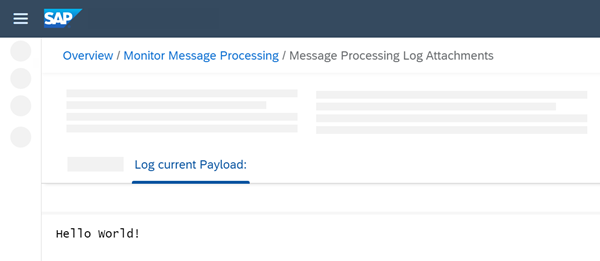

<!-- loio8f3851d4c67647c09f94b3a08caf6d90 -->

# Monitor Message Processing

Run the integration flow and check the result of message processing.

When the integration flow has been deployed successfully, the message is processed without any further trigger \(based on the settings of the timer\).

1.  Go to the Operations view and select a tile under *Monitor Message Processing*.

    If your integration flow has been processed successfully, the status *Completed* should be shown.

2.  Select the integration flow and analyze the details area to the right of the integration flow list.

3.  Under *Attachments*, click *Log current Payload*.

    You should see the message content, which consists of the following text:

    `Hello World!`

    

This shows you that the message has been processed correctly.

