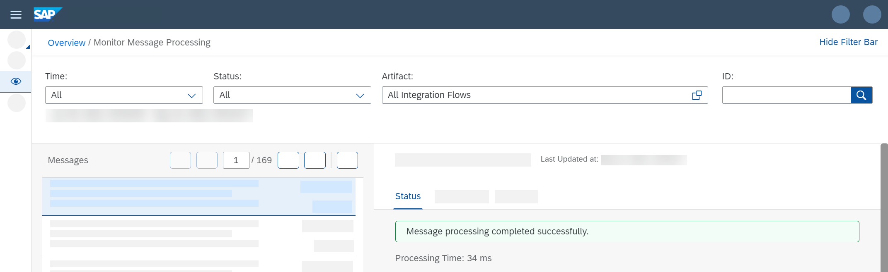

<!-- loiod18a6448dc5a46fca92bd958d01e03ab -->

# Monitor Message Processing

As you use a Timer event to trigger the message processing, the integration flow is processed as soon as it is deployed.

1.  To check whether the processing has been executed correctly, go to your e-mail account. You should find a mail with the following content:

    

2.  Finally, check how the message was processed by opening the *Monitor* section of the Web UI.

3.  Choose a tile under *Monitor Message Processing* and you should find your message with the integration flow name.

    

4.  Open the integration flow in Edit mode, click the first Content Modifier and on the *Message Body* tab change the value of the productIdentifier to HT-2001 and redeploy the integration flow.

5.  Once the integration flow has been deployed successfully, you should receive an e-mail with details about another product.

**Related Information**  

[Monitor Message Processing](../Operations/monitor-message-processing-314df3f.md "The message monitor provides an overview of the messages processed on a tenant and allows you to display the details for individual messages.")

