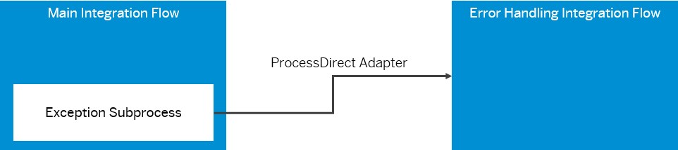

<!-- loio7f3bb85ebad84d67b6b97058547a8e8f -->

# Outsource Exception Handling into a Separate Integration Flow

To continue message processing even after an exception has been handled in the integration flow, outsource exception handling logic into a separate integration flow.

Guideline [Handle Exceptions](handle-exceptions-ca95c61.md) explains in general how to use an Exception Subprocess. Depending on the end event type of the Exception Subprocess, in the exception case the integration flows goes either into status *Completed* or *Failed*.

In many cases, you need to continue with message processing even after the exception has occurred. By default, message processing is stopped once the exception has been caught and handled in the exception subprocess.

In this topic, we show how to use an Exception Subprocess to outsource exception handling to another integration flow.

<a name="loio7f3bb85ebad84d67b6b97058547a8e8f__section_mmn_pmr_tjb"/>

## Implementation

Assuming you've created an integration flow that contains the main integration logic. This integration flow also contains an Exception Subprocess that takes over message processing if an exception occurs.

To decouple the error handling-related steps from the main integration flow, a 2nd integration flow is available. This integration flow is called the **error handling integration flow** and contains all steps required for error handling. Both integration flows are connected with a ProcessDirect adapter.

When at runtime an error occurs during the processing of the main integration process, the Exception Subprocess in *integrationflow\_main* calls *integrationflow\_errorhandling* through the ProcessDirect adapter.

To be precise, the Exception Subprocess in the main integration flow contains a step \(either an End Message event or a Request Reply step\) that contains a ProcessDirect channel to the error handling integration flow.

If an error occurs in the main integration process, the Exception Subprocess takes over and activates the error handling integration flow. The latter one processes all steps required for error handling, decoupled from the main integration flow.

Depending on whether the Exception Subprocess in the parent integration flow ends with an *End Message* or an *Error End* event, in the exception case the integration process gets a different status during monitoring \(as shown with guideline [Handle Exceptions](handle-exceptions-ca95c61.md)\).

<table>
<tr>
<td valign="top">

End Message event

</td>
<td valign="top">

If an exception occurs, parent integration flow ends with status *Completed*.

</td>
</tr>
<tr>
<td valign="top">

Error End Event

</td>
<td valign="top">

If an exception occurs, parent integration flow ends with status *Failed*.

</td>
</tr>
</table>

The 2 corresponding variants are described separately.

**Related Information**  

[Variant: Exception Subprocess with End Message Event](variant-exception-subprocess-with-end-message-event-c830df7.md "")

[Variant: Exception Subprocess with Error End Event](variant-exception-subprocess-with-error-end-event-35262c9.md "")

