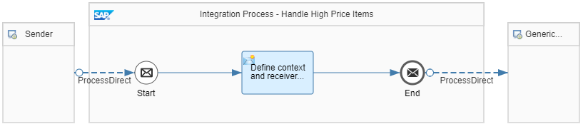

<!-- loio0bcf78d8e9694d02947298071aa73a7a -->

# Outsource Integration Logic into Separate Integration Flows

This variant illustrates outsourcing parts of the integration into separate integration flows.

The *Preserve Readability - Apply Balanced Encapsulation* integration flow reads product details \(for a *productId* value given with the inbound HTTP request header\) from the WebShop system. Depending on the price of the product, different integration flows are called:

> ### Note:  
> The *Encode header* Script step encodes the header provided with the inbound message in order to meet the security-related guideline [Encode Dynamic Parameters](encode-dynamic-parameters-d278350.md).

-   When the price is higher than 500 \(in the given currency\), the *Preserve Readability - Apply Balanced Encapsulation - Process High Price Items* integration flow is called through the ProcessDirect adapter.

-   When the price is lower than 500 \(in the given currency\), the *Preserve Readability - Apply Balanced Encapsulation - Process Low Price Items* integration flow is called through the ProcessDirect adapter.

For the sake of simplicity, both target integration flows are designed in a similar way.

To show an example, the *Preserve Readability - Apply Balanced Encapsulation - Process High Price Items* integration flow has the following structure:

Both integration flows call the generic receiver and create a data store entry \(with *Data Store Name* set to *PreserveReadability-Encapsulation*\).

The only difference between the target integration flows is the following:

-   *Preserve Readability - Apply Balanced Encapsulation - Process High Price Items* creates an entry with the *Entry ID* value *HighPrice*.

-   *Preserve Readability - Apply Balanced Encapsulation - Process Low Price Items* creates an entry with the *Entry ID* value *LowPrice*.

You call the *Preserve Readability - Apply Balanced Encapsulation* integration flow with an HTTP client. You need to provide the *productId* header with the HTTP request.

When you use the Postman collection provided with the integration package, the *productId* value *HT-2001* is provided with the request as the default value \(for a low price item\). To check out *productId* values for other products, you can browse through the WebShop catalog \(see [WebShop Example Application](webshop-example-application-767d8ef.md)\).

> ### Note:  
> Both target integration flows are designed in a similar way for sakes of simplicity. Note that this scenario could also be designed in an even more simple way, by modeling it with only one main integration flow. In that case, configure the *receiver* header value dynamically in the corresponding route to generate different data store entries depending on the price.
> 
> However, consider that in real life scenarios the separate integration flows implement different business logic. In such cases, it makes sense to outsource the different business logic into different integration flows.

**Related Information**  

[Define Local Integration Process](define-local-integration-process-520341a.md "You use the local integration process to simplify your integration process. You can break down the main integration process into smaller fragments by using local integration processes. You combine these fragments to achieve your main integration process.")

[ProcessDirect Adapter](processdirect-adapter-7445718.md "Use ProcessDirect adapter (sender and receiver) to establish fast and direct communication between integration flows by reducing latency and network overhead provided both of them are available within a same tenant.")

