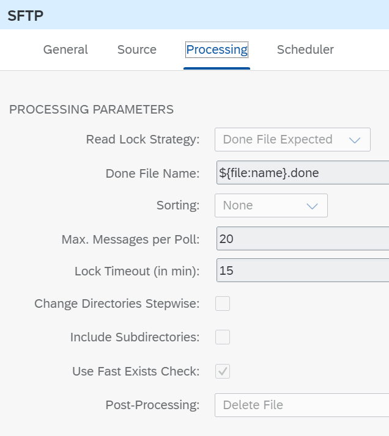

<!-- loio800de6e5bbf7422abd071e9b80016296 -->

# Poll File by Done File

Learn how to poll a file from an SFTP server triggered by a done file with the same name.

You like to avoid that a file is already picked up by the SFTP adapter while it is still being written to the SFTP server. This can be achieved via a done file which ensures that a file won’t be processed by the SFTP adapter until a done file is put into the very same directory that the actual file should be polled from.

This section shows you how to configure the SFTP Sender Adapter. For more information about the SFTP adapter, see [SFTP Adapter](sftp-adapter-e3dce88.md).

<a name="loio800de6e5bbf7422abd071e9b80016296__section_r4v_y1v_rrb"/>

## Implementation

To showcase how to poll a file triggered by a done file, we use a simple scenario. The example integration flow **File Transfer – Poll File by Done File** is designed the following way:

In the *Source*tab of the SFTP sender adapter, enter the *Directory* and *File Name*, *Address* of the SFTP server \(`host:port`\), *Proxy Type* \(On-Premise/Internet\), Location ID \(if On-Premise\) and *Credential Name*to access the SFTP server. Those parameters are externalized so that you can use your own SFTP server. See [Configure Externalized Parameters of an Integration Flow](configure-externalized-parameters-of-an-integration-flow-462a478.md)

> ### Note:  
> The credentials must have been deployed before in the *security material* area of theSAP Cloud Integration.

In the *Processing* tab, select the *Done File Expected* as *Read Lock Strategy*. This way we say that no file is read until the done file entered in next field is available in the same directory of the SFTP server.

In the *Done File Name*, enter `${file:name}.done`. This way, the files will be read if another file with the same name and the extension `.done` exists in the directory.

Once the file has been successfully processed, the done file is deleted from the SFTP server.

> ### Note:  
> The SFTP sender adapter does not check if the done file has a newer timestamp than the file to be read.

Once the scenario is executed, it creates an entry in the Data Store *FileTransfer-pollFileByDoneFile* with the content of the file read.

