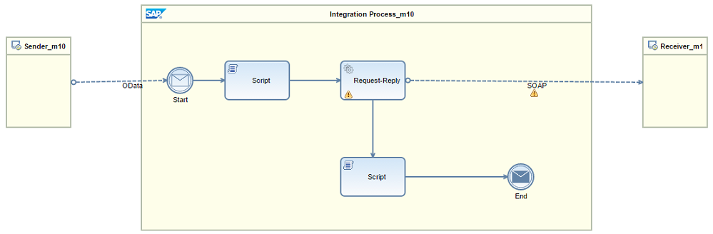

<!-- loio12a5f97ece3341a684c4ae3c0caf147e -->

# Predefined Integration Flow for Function Imports

This integration flow is autogenerated for function imports. In order to complete the binding to the SOAP Web service, you have to edit at least the Script elements for request and response mapping.

To understand this integration flow, let's look at an example.

## Example

You open an app on your smartphone to check the most frequently visited hotel in the city of New York and the number of guests that visited this hotel in the previous year. The hotel booking system publishes this data in the form of a SOAP Web service. The mobile application places this request in the form of a URI, where the city of New York is passed as a parameter.

When the OData sender channel receives the URI request, it passes it to the Script element. The Script element maps the request so that the SOAP receiver understands it.

The SOAP receiver processes the request and, if there are no issues with the request, returns the most frequently visited hotel and the guest count as the response. The Script element contains information that maps the fields from the SOAP structure to the return type defined in the OData model. The mapped data is then sent to the mobile application through the OData sender channel.

