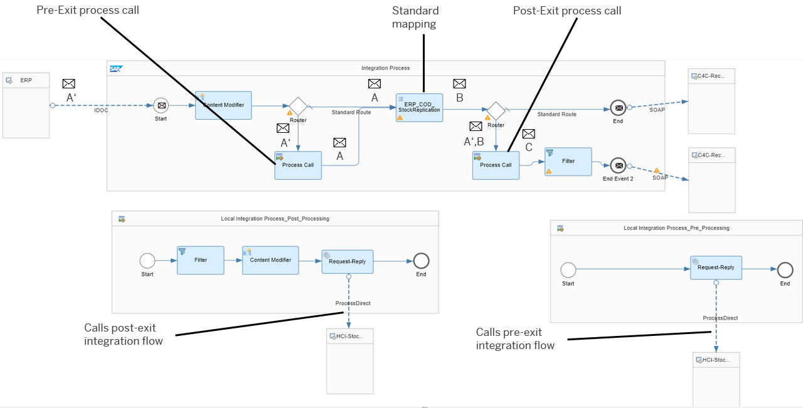
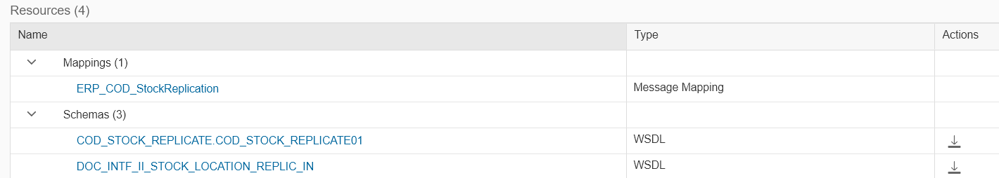

<!-- loio8e37f790137e440d87900a4f5e676391 -->

# Prerequisites

<a name="loio8e37f790137e440d87900a4f5e676391__section_zv4_d5g_ngb"/>

## Standard Integration Flow with Customer Exits

The standard integration flow \(provided as part of a predelivered integration content package\) with both a pre-exit and a post-exit has the following design. The message flow as explained above is also depicted.

<a name="loio8e37f790137e440d87900a4f5e676391__section_e4q_yfl_mgb"/>

## Required Integration Flow Resources \(WSDLs\)

Prerequisite: You have copied the integration package with the standard integration flow into your own workspace.

We also assume that you, the customer, have already defined the source message structure \(the extended IDoc structure A'\) and the target message structure that depends on the intended final mapping \(this is referred to as message C\).

> ### Note:  
> The WSDL files defining the message structures A and B \(source and target message of the standard mapping\) are contained as part of the standard integration flow \(from the predelivered integration package\).
> 
> You can get these by deploying the standard integration flow \(from the predelivered integration package\) on your customer tenant, opening the standard integration flow, clicking in the area outside the \(local\) integration process shapes, and selecting the *Resources* tab. Here, you will find the related WSDL files and you can download them.

The following figure shows the resources as uploaded to the standard integration flow:

-   `COD_STOCK_REPLICATE.COD_STOCK_REPLICATE01.wsdl` describes the original source structure for the standard mapping, which is an IDoc message \(**message A**\).

-   `DOC_INTF_II_STOCK_LOCATION_REPLIC_IN.wsdl` describes the target structure of the standard mapping \(**message B**\)

    .

The standard integration flow contains a mapping that transforms message A to message B. The following figure shows this mapping as displayed in the mapping editor:

> ### Note:  
> You must **not** change the standard integration flow.

