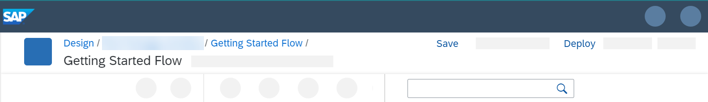
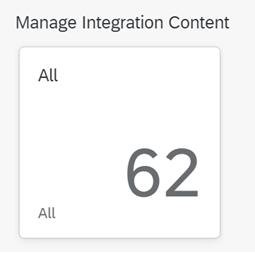
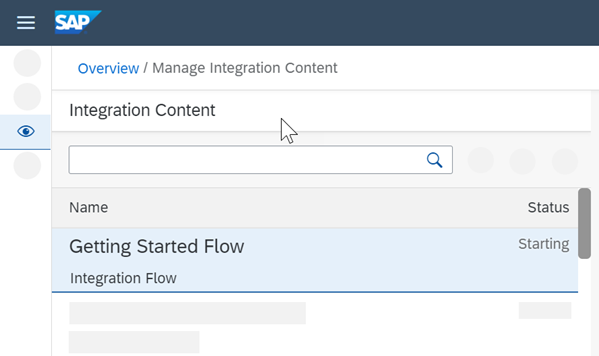
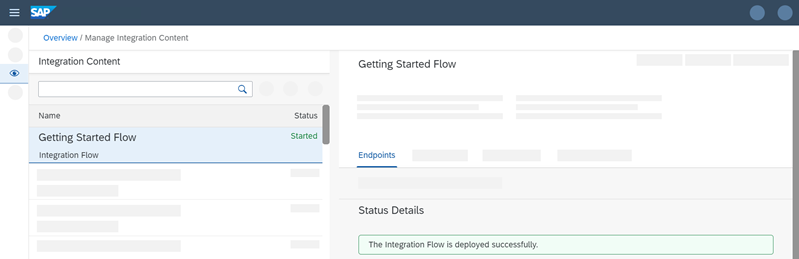

<!-- loio33a5123e424c431bbe55bcfba971c230 -->

# Save and Deploy the Integration Flow

Save and deploy the integration flow on the tenant to process it.

1.  When you've finished modeling the integration flow, select *Save*.

    

    Once saving has been successful, a corresponding status message is displayed.

2.  Select *Deploy*.

    A message is displayed that asks you to confirm this action.

3.  Select *Yes*.

    Another message is displayed when the validation has been performed and the integration flow deployment has been triggered.

4.  Select *OK*.

    After successful deployment, a status message is displayed.

    > ### Note:  
    > In case of a modeling error, instead of this message, a `Validation Failed` message is displayed. Only when you've fixed the error, the deployment of the integration flow is triggered.

5.  Choose the *Operations* view to check the status of the deployment.

6.  Select a tile in the section *Manage Integration Content*.

    

    You can check the deployment status of your integration flow.

    

    It changes from `Starting` to `Started`.

    

> ### Tip:  
> There's an alternative approach to deploy an integration flow:
> 
> Open the integration package that contains the integration flow to. Go to the *Artifacts* tab, select the *Actions* button \(next to the name of the integration flow that you like to deploy\) and select *Deploy*.

