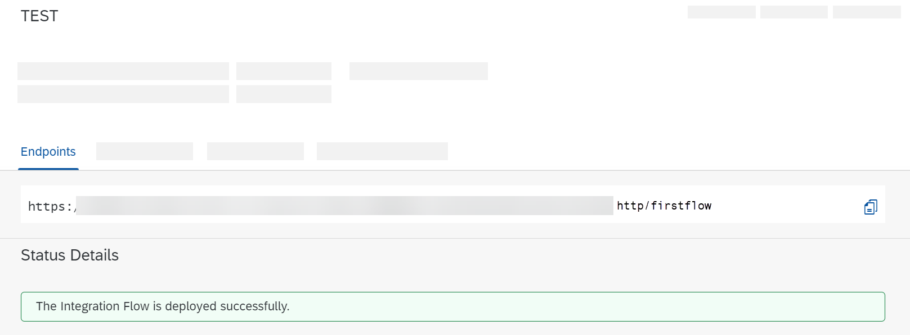

<!-- loiof08cca6af4fd48b687d3f86c329efaed -->

# Send the HTTP Request and Process the Integration Flow

Set up an HTTP client using Postman and send the HTTP request.

1.  Install an HTTP client on your computer.

2.  Since the HTTPS sender adapter is configured to expect *User Role* authorization, the authentication mode used is basic authentication \(with user credentials\).

    Select the corresponding authentication mode for your HTTP client.

    Depending on whether you work in the Neo or the Cloud Foundry environment, the way how to get the required credentials differs.

    -   Neo environment:

        Specify the credentials of the user that is associated with the inbound HTTP request and that has been assigned the role `ESBMessaging.send` in SAP BTP cockpit.

    -   Cloud Foundry environment:

        As credentials, enter the values of `clientid` and `clientsecret` that have been generated when you created the service key during onboarding.

        The following figure shows the related dialog from SAP BTP cockpit.

        


3.  As you have selected *CSRF Protected* in the HTTPS adapter, you need to fetch a CSRF token.

    The CSRF token is then used to place the POST request for your integration flow.

    1.  Find out the endpoint address of the integration flow. To do this, go to the *Monitor* section of the Web UI.

    2.  Choose a tile under *Manage Integration Content*.

    3.  Select your integration flow. It should be displayed in the list of deployed artifacts with status *Started*.

        

    4.  Copy the endpoint URL to the clipboard.

        The URL should end with `/http/<Address specified in the HTTPS adapter>`.


4.  Using your HTTP client, send a GET request to the endpoint address.

    Make sure that you send a header with the key `X-CSRF-token` and the value `fetch` with the request.

5.  You should receive the CSRF token.


You can now send the POST request to the integration flow.

1.  Specify the same authentication settings as for the GET request above.

2.  Specify the following HTTP request body \(JSON format\):

    > ### Sample Code:  
    > ```
    > {
    > 
    > 	"productIdentifier": "HT-1080"
    > 
    > }
    > ```

3.  Copy the value of the CSRF token \(obtained from the GET request above\) to the clipboard.

4.  Add a header to the request.

    In the *Key* field, enter `X-CSRF-Token` and in the *Value* field, enter the value of the CSRF token from your clipboard.

5.  Send the request.

    You should get the details of the product with productIdentifier HT-1080.

6.  Go to the e-mail account specified in the Mail adapter. You should have received an e-mail like this:

    

7.  Place another POST request with a body containing productIdentifier HT-2001, and you receive details of another product.

8.  Finally, check how the message was processed by opening the *Monitor* section of the Web UI.

    Choose a tile under *Monitor Message Processing* and you should find your message with the integration flow name.


**Related Information**  


 <?sap-ot O2O class="- topic/link " href="fd5fcb4f396348e9977b532dbd56a02e.xml" text="" desc="" xtrc="link:1" xtrf="file:/home/builder/src/dita-all/cvv1690968981196/loio3268cb35959d4b368fb49de861bfe8a1_en-US/src/content/localization/en-us/f08cca6af4fd48b687d3f86c329efaed.xml" ?> 

 <?sap-ot O2O class="- topic/link " href="3d99ae8a0cc6477196b7e0561f1897d6.xml" text="" desc="" xtrc="link:2" xtrf="file:/home/builder/src/dita-all/cvv1690968981196/loio3268cb35959d4b368fb49de861bfe8a1_en-US/src/content/localization/en-us/f08cca6af4fd48b687d3f86c329efaed.xml" ?> 

