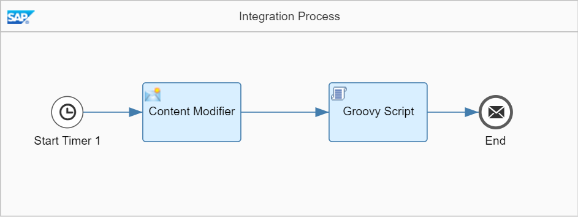

<!-- loio8c83fcf4a72241af9f05e26b3f866aa5 -->

# Smoke Test Scenario

This is a very simple test to verify that your SAP Cloud Integration is working as expected. You do not need any receiver system to perform this test.

In this scenario, you create a *Hello World* text and write it into the message body \(scheduled on deployment of the integration flow\). The result is written into the message processing log which you can directly inspect with the message monitoring application.

> ### Caution:  
> This integration scenario is designed to show how to quickly \(without much effort\) set up and run an integration flow without the need to configure and connect to any receiver system. It uses a Script step to store the message payload in the message processing log \(to enable you to easily check in the message monitoring application if the message was processed without any errors\).
> 
> Note that this is not according to standard best practice. When designing productive scenarios, don't store the message payload in the message processing log. This can cause severe issues with memory consumption. The reason is that tasks such as message processing and message monitoring share the same memory and CPU which are available on your tenant.

In the course of this exercise, you develop the following integration flow.

To make it as easy as possible for you to develop this first integration flow, you don't need to configure any sender system. That saves the effort for you to set up a dedicated sender system and to connect it to SAP Cloud Integration. Instead of this, message processing is triggered by a Timer event, and the inbound message payload is created *within the integration flow*, in a dedicated Content Modifier step.

Furthermore, it is also not required that you set up any receiver system. To enable you to check if the message has been processed correctly, you will configure the integration so that the message payload is written into the message processing log \(where you can easily inspect it using the *Monitor* application of the Web UI\).

This is how the integration flow will process the message at runtime:

1.  The Timer event triggers the processing of the message \(according to the settings of the Timer's scheduler\).

2.  The Content Modifier step creates a message with a simple text content \(*Hello World!*\).

3.  The Groovy Script step logs the payload of the message \(that means, it writes the message content into the message processing log\).

When you have finished the integration flow design, you save and deploy the integration flow.

You can then monitor message processing.

**Related Information**  

[Create a Content Modifier to Define the Message Body](create-a-content-modifier-to-define-the-message-body-766db40.md "Add a Content Modifier step to create the message body.")

[Create a Script Step to Log the Payload](create-a-script-step-to-log-the-payload-a0cd219.md "Add a Script step to log the message payload.")

[Save and Deploy the Integration Flow](save-and-deploy-the-integration-flow-33a5123.md "Save and deploy the integration flow on the tenant to process it.")

[Monitor Message Processing](monitor-message-processing-8f3851d.md "Run the integration flow and check the result of message processing.")

