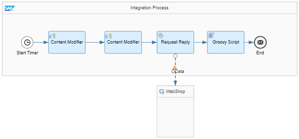

<!-- loioe4bef7446ad14c5a815b93ff20efebec -->

# Smoke Test Scenario with External Data Source

This is a very simple test to verify that your SAP Cloud Integration is working as expected. You do not need any receiver system to perform this test.

In this scenario, you access an OData API and get information about a product \(for a specific product ID\). The result is written into the message processing log which you can directly inspect with the message monitoring application.

> ### Caution:  
> This integration scenario is designed to show how to quickly \(without much effort\) set up and run an integration flow without the need to configure and connect to any receiver system. It uses a Script step to store the message payload in the message processing log \(to enable you to easily check in the message monitoring application if the message was processed without any errors\).
> 
> Note that this is not according to standard best practice. When designing productive scenarios, don't store the message payload in the message processing log. This can cause severe issues with memory consumption. The reason is that tasks such as message processing and message monitoring share the same memory and CPU which are available on your tenant.

In the course of this exercise, you develop the following integration flow.

To make it as easy as possible for you to develop this first integration flow, you don't need to configure any sender system. That saves the effort for you to set up a dedicated sender system and to connect it to SAP Cloud Integration. Instead of this, message processing is triggered by a Timer event, and the inbound message payload is created *within the integration flow*, in a dedicated Content Modifier step.

Furthermore, it is also not required that you set up any receiver system. To enable you to check if the message has been processed correctly, you will configure the integration so that the message payload is written into the message processing log \(where you can easily inspect it using the *Monitor* application of the Web UI\).

This is how the integration flow will process the message at runtime:

1.  The Timer event triggers the processing of the message \(according to the settings of the Timer's scheduler\).

2.  The first Content Modifier step creates a message with only one element, a `productIdentifier` \(to identify a product from the product catalog\).

    The actual value of the `productIdentifier` is *hard-coded* in this step. If you like to process the integration flow with another product identifier, you need to change the value in this step and re-deploy the integration flow again. This is the drawback which results from abstaining from a dedicated sender system.

3.  The second Content Modifier creates a message header \(which we also call `productIdentifier`\) and writes the actual value of the `productIdentifier` element into it. This header will be used in the subsequent step.

4.  The Request Reply step passes over the message to an external data source and retrieves data \(about products\) from there.

    The external data source is represented by the lower `WebShop` shape.

    The external data source supports the Open DataProtocol \(OData\). For our scenario, we use the ESPM WebShop, which is based on the Enterprise Sales and Procurement Model \(ESPM\) provided by SAP.

    For the connection to the WebShop, an OData receiver channel is used. To query for exactly one product \(for the product identifier provided with the inbound message\), the header that has been created in the preceding Content Modifier is used.

5.  The OData API provides the details of one specific product \(according to the product identifier provided with the inbound message\).

6.  The Groovy Script step logs the payload of the message \(that means, it writes the message content into the message processing log\).

You can then run the integration flow and monitor message processing as described under: [Run the Integration Flow and Monitor the Message Processing](run-the-integration-flow-and-monitor-the-message-processing-82d6232.md).

**Related Information**  

 <?sap-ot O2O class="- topic/link " href="dc464296532f4d5aa7e49fc21e016b79.xml" text="" desc="" xtrc="link:1" xtrf="file:/home/builder/src/dita-all/cdo1688560638547/loio3268cb35959d4b368fb49de861bfe8a1_en-US/src/content/localization/en-us/e4bef7446ad14c5a815b93ff20efebec.xml" ?> 

 <?sap-ot O2O class="- topic/link " href="1399da491e7946999ead9566ae751311.xml" text="" desc="" xtrc="link:2" xtrf="file:/home/builder/src/dita-all/cdo1688560638547/loio3268cb35959d4b368fb49de861bfe8a1_en-US/src/content/localization/en-us/e4bef7446ad14c5a815b93ff20efebec.xml" ?> 

 <?sap-ot O2O class="- topic/link " href="b60b009577f54f7eb56b457c16b25b26.xml" text="" desc="" xtrc="link:3" xtrf="file:/home/builder/src/dita-all/cdo1688560638547/loio3268cb35959d4b368fb49de861bfe8a1_en-US/src/content/localization/en-us/e4bef7446ad14c5a815b93ff20efebec.xml" ?> 

 <?sap-ot O2O class="- topic/link " href="b08ee602f6954b2eb3cfd111f9a4d367.xml" text="" desc="" xtrc="link:4" xtrf="file:/home/builder/src/dita-all/cdo1688560638547/loio3268cb35959d4b368fb49de861bfe8a1_en-US/src/content/localization/en-us/e4bef7446ad14c5a815b93ff20efebec.xml" ?> 

[Create the Script Step to Log the Payload](create-the-script-step-to-log-the-payload-613181e.md "Add a Script step to log the message payload.")

[Run the Integration Flow and Monitor the Message Processing](run-the-integration-flow-and-monitor-the-message-processing-82d6232.md "Run the integration flow and check the result of message processing.")

