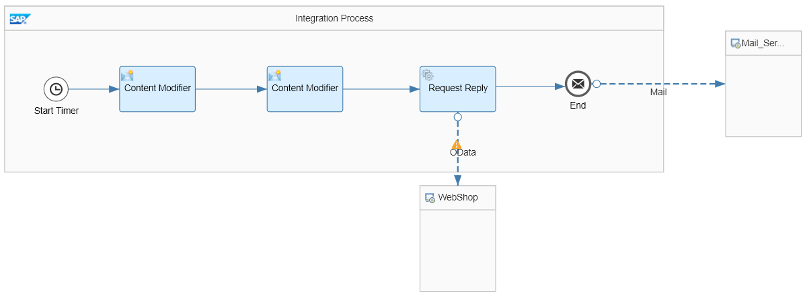

<!-- loiobfee17e150de43c9a1b363746c5a7e72 -->

# Timer-Initiated Scenario with a Mail Receiver

Create a simple integration scenario that is initiated by a timer, retrieves data from an external source, and sends the result to an e-mail account \(as the receiver system\).

A typical challenge addressed by an integration scenario is to retrieve data from a certain source \(for example, product details from a product catalog on a vendor's site\) using certain filter criteria. We use the integration flow described in this section to address such a use case.

In the course of this exercise, you develop the following integration flow:

To make it as easy as possible for you to develop this integration flow, you don't need to configure a sender system. This saves you the effort of setting up a dedicated sender system and connecting it to SAP Cloud Integration. Instead, message processing is triggered by a Timer event, and the inbound message is created *within the integration flow*, in a dedicated Content Modifier step.

As a prerequisite to use the Mail adapter, you need to take care of the following things.

-   Update the tenant keystore with the certificates required by the mail server.

-   Create and deploy a *User Credentials* artifact that contains the credentials of the mail account.

This is how the integration flow processes the message at runtime:

1.  The Timer event triggers the processing of the message \(according to the settings of the Timer's scheduler\).

2.  The first Content Modifier step creates a message with only one element: a `productIdentifier` \(to identify a product from the product catalog\).

    The actual value of the `productIdentifier` is *hard-coded* in this step. If you want to process the integration flow with another product identifier, you need to change the value in this step and redeploy the integration flow. This is the drawback of not having a dedicated sender system.

3.  The second Content Modifier step creates a message header \(which we also call `productIdentifier`\) and writes the actual value of the `productIdentifier` element into it. This header is used in the subsequent step.

4.  The Request Reply step passes the message to an external data source from which it retrieves data \(about products\).

    The external data source is represented by the lower `WebShop` shape.

    The external data source supports the Open DataProtocol \(OData\). For our scenario, we use the ESPM WebShop, which is based on the Enterprise Sales and Procurement Model \(ESPM\) provided by SAP.

    An OData receiver channel is used to connect to the WebShop. The header that was created in the preceding Content Modifier is used to query exactly one product \(using the product identifier provided with the inbound message\).

5.  The OData API provides the details of this product.

6.  Finally, the result of the request is forwarded to an e-mail account using the Mail receiver adapter \(the e-mail server is represented by the `Mail_Ser …` shape on the right in the integration flow model\).

When you have finished integration flow design, you can monitor message processing.

This integration flow introduces you to a number of important aspects of integration development, such as defining an OData query and using a message header to dynamically query an OData source.

**Related Information**  

[Update the Tenant Keystore with the Certificates Required by the Mail Server](update-the-tenant-keystore-with-the-certificates-required-by-the-mail-server-5d5495e.md "Add the required server root certificates (required by the e-mail provider) to the tenant keystore.")

[Create and Deploy a User Credentials Artifact for the E-Mail Account](create-and-deploy-a-user-credentials-artifact-for-the-e-mail-account-1c1fced.md "Deploy a User Credentials artifact that contains the user name and password for your receiver mail account.")

[Create the Mail Receiver Channel](create-the-mail-receiver-channel-a6966fd.md "Add a Mail receiver channel to enable the integration flow to send messages to an e-mail account.")

[Monitor Message Processing](monitor-message-processing-d18a644.md "")

