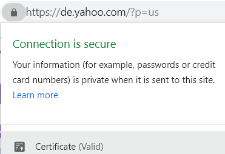
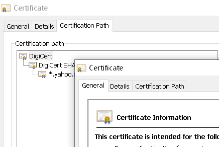
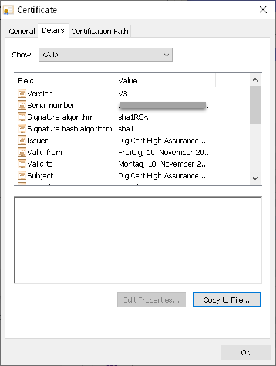
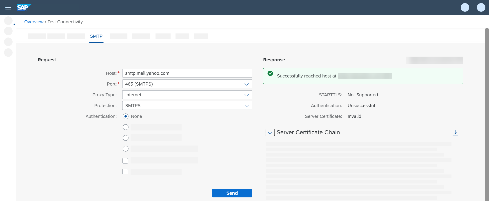

<!-- loio5d5495ed1d94477abaa009984285e483 -->

# Update the Tenant Keystore with the Certificates Required by the Mail Server

Add the required server root certificates \(required by the e-mail provider\) to the tenant keystore.

The tenant keystore contains the key pairs and certificates that are required \(on the tenant side\) to establish trusted communication with the connected systems.

When establishing the connection to the SAP Cloud Integration tenant, the e-mail server needs to authenticate itself against SAP Cloud Integration using a digital server certificate. For this purpose, the tenant keystore must contain a root certificate that is also trusted by the e-mail server.

You can download the required certificates usually on a dedicated section of the email provider's website. You can search for *server certificate* to get more information. Note that the procedure can differ depending on the email provider.


<a name="loio5d5495ed1d94477abaa009984285e483__section_lvr_yxr_k3b"/>

## Get the E-Mail Servers' Certificate

To get the e-mail servers' root certificate, you can do the following:

1.  Open the website that hosts the mail account you like to address with the Mail adapter.

2.  In the browser address field, click the lock icon and select *Certificate \(Valid\)* \(example for using Google Chrome\).

    

3.  In tab *Certification Path*, doubleclick the uppermost node \(which is the root certificate\).

    

4.  Click *Details* and select *Copy to File ...*.

    

5.  In the wizard, click *Next*.

6.  On the next screen, keep the setting *DER encoded binary X.509 \(.CER\)* and click *Next*.

7.  Choose a directory on your computer where to store the certificate file and a name.

8.  Click *Next* and then *Finish*.


The root certificate is stored as file with extension `.cer` on your computer.


<a name="loio5d5495ed1d94477abaa009984285e483__section_nrj_4hd_ygb"/>

## Get the E-Mail Servers' Certificate

A smart way to get the required certificates is by using the Connectivity Test application provided as part of SAP Cloud Integration.

> ### Remember:  
> There are currently certain limitations when working in the Cloud Foundry environment. For more information on the limitations, see SAP Note [2752867](https://me.sap.com/notes/2752867).

1.  Go to the Monitor section of the Web UI and select the *Connectivity Tests* tile under *Manage Security*.

2.  Choose *SMTP*.

3.  Specify the following parameters.

    -   *Host*: Enter the address of the e-mail provider \(for the SMTP protocol\). This is the same address that you specified in the Mail receiver adapter \(without the port\), for example, `smtp.mail.yahoo.com`.

    -   *Proxy Type*: Select *Internet*.

    -   *Port*: Select the port that you specified in the Mail receiver adapter \(for example, *465 \(SMTPS\)*\).

    -   *Authentication*: Select *None*.

    -   Deselect the option *Validate Server Certificate*.


4.  Choose *Send*.

    The resulting response shows details about the certificates required by the e-mail server.

    

5.  Choose *Download*.

    The certificates are downloaded as a compressed file on your computer.

6.  Extract the certificates on your computer from the compressed \(.zip\) file.


Finally, you need to import the downloaded certificates to the tenant keystore. To do this, open the Keystore monitor.

1.  Go to the Monitor section of the Web UI and select the *Keystore* tile under *Manage Security*.

    All certificates that are already included in the keystore are displayed. These certificates are initially provided by SAP.

2.  Choose *Add* \> *Certificate*.

    

3.  Browse to the certificate stored on your computer, provide an alias \(to identify the certificate in the keystore\) and choose *Deploy*.

4.  Repeat this task for all certificates that you have downloaded.


> ### Note:  
> You also need to change the settings of your e-mail account so that the mail server accepts connections to remote applications with a lower security level \(for example, for Yahoo mail, this is the Less Secure Apps setting\). If you don't do this, the integration flow raises an error during processing.

> ### Note:  
> If you don't upload the required root certificate to the tenant keystore and try to execute the integration flow \(when having finished its design\), message processing fails with the following error message starting with:
> 
> > ### Sample Code:  
> > ```
> > javax.mail.MessagingException: Could not connect to SMTP host: smtp.mail.yahoo.com, port: 465;
> > nested exception is:
> > javax.net.ssl.SSLHandshakeException ...
> > ```

**Related Information**  


[SMTP Connectivity Tests](../Operations/smtp-connectivity-tests-8f8e028.md "You can perform SMTP connectivity tests to check the settings required for configuring the receiver mail adapter.")

[Managing Keystore Entries](../Operations/managing-keystore-entries-2dc8942.md "The Keystore Monitor allows a tenant administrator to manage the tenant keystore and its entries (X.509 certificates and key pairs).")

[Setting Up Outbound Mail Connections](../ConnectionSetup/setting-up-outbound-mail-connections-8b112ba.md "Using the mail receiver adapter, you connect the tenant with an e-mail server so that the tenant can send emails to the e-mail server.")

