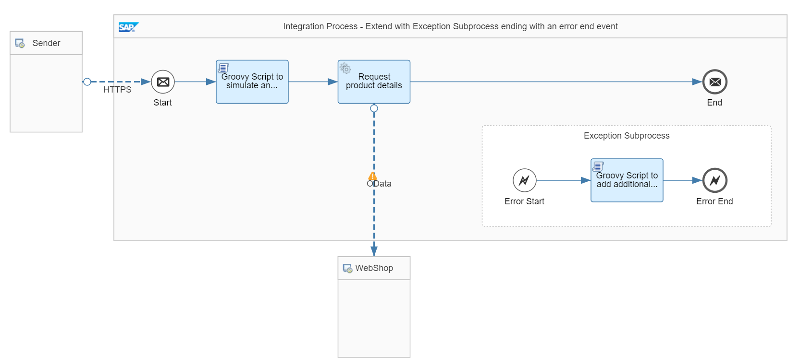

<!-- loioc03201640c2f41c1938b53c6367ecd59 -->

# Variant: Exception Subprocess with Error End Event

Use this variant to catch an error in an exception subprocess to add additional information to the message processing log. In this use case, the message status is set to Failed.


<a name="loioc03201640c2f41c1938b53c6367ecd59__section_z5n_qkq_qnb"/>

## Definition

For this variant, the integration flow is extended with an exception subprocess to add additional information to the message processing log \(see: [Log the Behavior of an Integration Flow](log-the-behavior-of-an-integration-flow-5a3ec6d.md)\) which help you to improve the root cause analysis. The message then is in status Failed.


<a name="loioc03201640c2f41c1938b53c6367ecd59__section_xnr_rkq_qnb"/>

## Implementation

To illustrate this rule, see the *Handle Errors - Extend With Exception Subprocess – Error End Event* integration flow.



To call this integration flow, provide a productId header together with the HTTP request \(from the HTTP client\) and give it any value for a product published in the WebShop catalog \(for example, the value HT-2001\).

Furthermore, via the header field error, you can control the processing of the integration flow. For instance, if you like the integration flow to be successfully processed, set the error header to false; or, if you like to simulate an error situation, you need to set the error header to true.

> ### Note:  
> When you use Postman together with the Postman collections provided with the integration package, remember that a value for this header is already specified for the request. You can, however, overwrite this value.

The integration flow requests product details from the WebShop product catalog for this productId.

The OData adapter that gets the product details expects a data format as defined by the following query \(in the OData adapter\): `$select=ProductId,Category,LongDescription,Name,Weight,DimensionDepth,DimensionHeight,DimensionWidth,DimensionUnit&$filter=ProductId eq '${header.productId}'`.

In a groovy script right before the actual request-response step, a property path is set depending on the value of the error header. If an error is triggered, the path is set in such a way that the OData call fails with an http 404 error.

If there's an error, the steps within the exception subprocess are carried out. The exception subprocess contains a groovy script that adds an attachment to the message processing log containing additional information. The script is defined as follows:

```
import com.sap.gateway.ip.core.customdev.util.Message
import java.util.HashMap
def Message processData(Message message) {
    //Headers 
    def head = message.getHeaders();
    def productId = head.get("productId");
    //Body  
    String body = "An error occured when calling the product catalog with productId equals " + productId;
    def messageLog = messageLogFactory.getMessageLog(message);
    if (messageLog != null) {
        messageLog.addAttachmentAsString('Additional Information', body, 'text/plain');
    }
    return message;
}

```

Here, the product ID is read from the header and added to the body of the attachment.

The exception subprocess ends then with an error end event.

To easily simulate an error situation, you can run the integration flow by setting the `error` header to `true`. In the message monitoring, the corresponding message processing log is in status *Failed*. Furthermore, in the log, an attachment has been added with the body as defined within the exception subprocess.

**Related Information**  


[Define Exception Subprocess](define-exception-subprocess-690e078.md "")

[Create MPL Attachments in Scripts](create-mpl-attachments-in-scripts-17dba92.md "")

[Define End Message Event](define-end-message-event-4774b5f.md "An End Message event ends a message processing sequence.")

