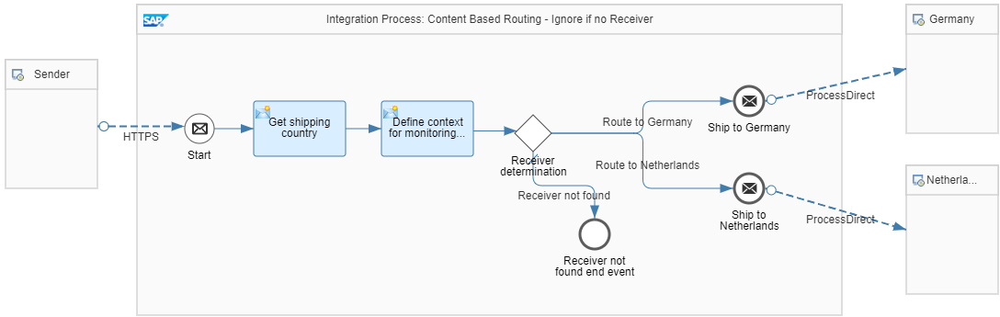

<!-- loio4998bd8aaed349c188a170e8d4eb7b63 -->

# Variant: Ignore

The reference integration flow *Pattern Content Based Routing - Ignore If No Receiver* uses the same routing condition as in [Variant: Send to Default Receiver](variant-send-to-default-receiver-7ba1864.md).

In this variant, however, the message is discarded if neither routing condition is met, meaning that no receiver can be determined at runtime. Like in [Variant: Send to Default Receiver](variant-send-to-default-receiver-7ba1864.md), the value of theXPath expression is stored as an Exchange property that is then used in the particular routing conditions.

For each receiver, the routing condition is configured accordingly. In addition, a route is configured that points to an End event.

For the route that points to the End event, the *Default Route* option is selected. As a result, message processing ends if no receiver is found \(no message is delivered\).

**Related Information**  

[Define Router](define-router-d7fddbd.md "")

