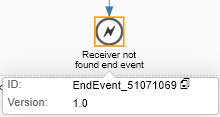

<!-- loiob1148e9eeb724c9aafa6ca25bc3c03f4 -->

# Variant: Raise an Error

In the reference integration flow, *Pattern Content Based Routing - Raise Error*, an error is raised if no receiver can be determined. The integration flow is modeled similar to [Variant: Ignore](variant-ignore-4998bd8.md). As an exception, the default route now leads to an Error End event. In addition, an Exception Subprocess is added which handles the exception. As a result, if no routing condition is met, an error event is raised which is fetched by the Exception Subprocess.

Different message processing options are modeled for the Exception Subprocess. The options depend on whether the event is triggered by the Error End event within the main integration process or any other error that can occur during message processing. An example for the latter, is that a receiver is temporarily unavailable.

To model this behavior, a Router step with 2 routes is added. One route handles the situation where no receiver could be determined. The other route handles any other error situation.

In the Exception Subprocess, routing is based on the step ID.

The error classification is done using the step ID of the Error End event. In the routing condition, the *SAP\_ErrorModelStepID* Exchange property is used, which contains the step ID where an error occurred. The following condition expression is configured:

*$\{property.SAP\_ErrorModelStepID\} = 'EndEvent\_51071069'* 

The condition expression uses the actual step ID of the Error End event.

> ### Note:  
> If you want to determine the step ID, you can first click on the Error End event shape.
> 
> 
> 
> Then click the *Technical Information* button.
> 
> 

The other route is defined as the default route.

**Related Information**  

[Define Router](define-router-d7fddbd.md "")

[Define Exception Subprocess](define-exception-subprocess-690e078.md "")

