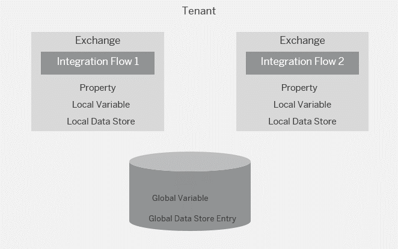

<!-- loio1459948623fb4158bcbde0693494b9a6 -->

# Variant: Sharing Data Across Integration Flows That Operate Independently from Each Other

Integration flows run independently from each other but need to share data.

Assume that one timer-based integration flow looks up and consolidates data from a source component on a regular basis. A 2nd integration flow \(running independently from the 1st one\) needs to know the time when the first integration flow was processed \(to be used in a notification mail, for example\).

In this case, data can only be shared across integration flows through global variables or global data stores.

In this setup, there's no other option to share data across integration flows than using global variables or global data stores \(which requires storage capacity on the tenant\).

<a name="loio1459948623fb4158bcbde0693494b9a6__section_srx_5kb_xkb"/>

## Implementation

The integration pattern [Scatter-Gather](scatter-gather-987eef2.md) is also a good example to illustrate this guideline variant.

This integration flow comprises multiple integration processes.

> ### Note:  
> Note that you can also implement this pattern by deploying each integration process as a separate integration flow.

In this scenario, a global data store \(name: *ScatterGather-ActiveBids*\) is used to store data that is to be shared across the individual integration processes.

For another simple example scenario, see [Example Using a Global Data Store and a Global Variable](example-using-a-global-data-store-and-a-global-variable-773a7ec.md).

