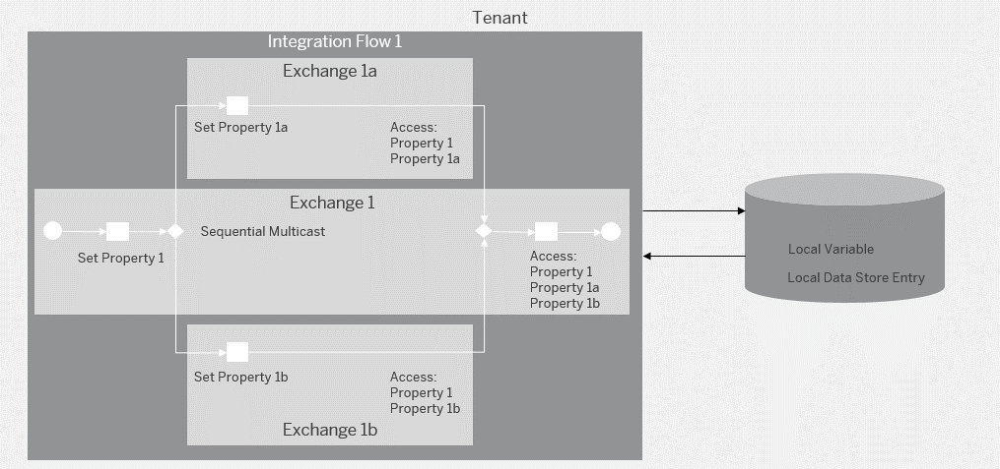

<!-- loio4b75ded0ac8648eaa7871f95201d7e6b -->

# Variant: Sharing Data Within the Same Integration Flow

To share data across different steps of the same integration flow, the general recommendation is to use properties.

Alternatively, you can also use headers or persistency \(local variables or local data store\). However, these options come with the following disadvantages:

-   Using headers exposes the information to the outside world when doing intermediate calls, and the size is restricted to the limit of the network components.

-   The persistency option requires access to the tenant database, and accessing the database is slower than accessing the memory.

Using properties is fast and there's no size restriction, except for the overall memory of the used Cloud Integration instance.

Furthermore, when using properties, there are specific rules that depend on which of the following conditions applies:

-   During the operation of the integration flow, a single exchange is active.

    In this case, a property can be shared across the whole integration flow without any limitation.

-   During the operation of the integration flow, multiple exchanges are active.

    In this case, there are certain limitations in sharing a property across the whole integration flow.

<a name="loio4b75ded0ac8648eaa7871f95201d7e6b__section_ngs_z5w_vkb"/>

## Header or Payload Changed/Deleted During Processing Sequence

Assume one of the following cases with an integration flow that only opens a single exchange.

-   The integration flow receives a header from a remote component \(for example, through a sender adapter\). The value of the header is required at a later point in the processing of the same integration flow. Furthermore, there's a step in between that calls a remote component through a certain adapter.

    In such a setup, it can be that the header is deleted at the step that calls the remote component. If that happens, depends on the adapter type. An adapter that deletes headers is the JDBC adapter \(to mention an example\).

    

    In this case, it's recommended to create an exchange property out of the received header in the initial phase of the integration flow sequence. The header value \(now stored as a property in the Camel exchange\) is available throughout the whole integration flow without any limitation.

-   The payload of the message is required in a subsequent step of the integration flow. However, there are steps in between where the payload is modified.

    In this case, you can store the actual payload as exchange property and use this property at the later step in the processing sequence.

    

    To illustrate how this behavior is designed, refer to the integration flow for the [Scatter-Gather](scatter-gather-987eef2.md) pattern. The integration flow described under Handling Inactive Biddings stores the original payload of the message in an exchange property to make it available at a later step.

Note that this is the case only if not more than a single exchange container is active through the processing of the integration flow.

<a name="loio4b75ded0ac8648eaa7871f95201d7e6b__section_e45_w5w_vkb"/>

## Multiple Exchanges Involved

There are certain cases where exchange properties can't be shared across different parts of the same integration flow. This is the case when multiple exchanges are opened during the processing of the integration flow. An example is the usage of the Multicast pattern.

In a multicast pattern, the main branch of the integration flow is split into multiple child branches that are processed either in parallel \(parallel multicast\) or in a defined order \(sequential multicast\).

There are the following constraints:

-   Headers and properties set in the main branch before the multicast step are available in the child branches.

-   Headers and properties set in a child branch aren't available in other child branches.

-   When the multicast branches are again merged in a Join and Gather step, properties that are set in the child branches are available in the main branch. However, headers that are set in the child branches aren't available in the main branch.

Assume that in a sequential multicast scenario there's the requirement that a value set in 1 branch is available in a subsequent branch.

In this case, you have the option to use the local persistence \(variable or data store\) to share this data across the different branches.

