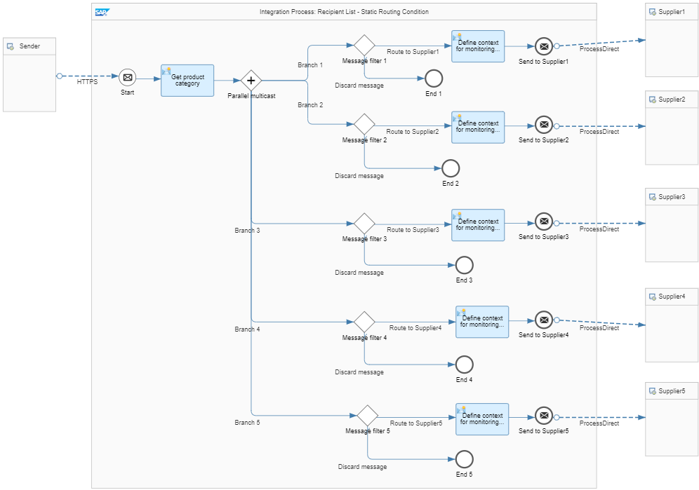

<!-- loiob71529f0cf714cc4abda84bf607277b5 -->

# Variant: Static Routing

This variant is illustrated by the *Pattern Recipient List - Static Routing* reference integration flow. In this model, the potential list of receivers is fixed. The recipient list pattern is realized via a combination of multicast and message filters.

First, the Multicast step is used to send copies of the same message to multiple routes. The Message Filter is a specific type of the message router that has only one single receiver channel. Any incoming message is evaluated, and if it meets the criteria specified by the Message Filter, the message is routed to the receiver, otherwise it's discarded.

A Content Modifier stores the XPath expression value in an exchange property \(called *productCategory*\). It accesses the desired value from the message using the XPath expression `/ns0:Item/Category`.

> ### Tip:  
> Instead of directly accessing the content of the message via an XPath in each router, a property is used for the XPath for 2 reasons: this measure improves traceability and ensures better runtime behavior \(since the message needs to be parsed only once\).

A Parallel Multicast router with 5 branches is modeled. For each branch, a router with 2 routes is modeled, one pointing to a Message End event and the other pointing to an End event. For the former route, condition expressions are given based on the previously created exchange property.

-   For the first 2 branches: `${property.productCategory} = 'Software'`

-   For the 3rd branch: `${property.productCategory} = 'Notebooks'`

-   Branches four and five: `${property.productCategory} = 'Notebooks'` or `${property.productCategory} = 'Keyboards'`

    The latter route in each branch is set as the default route. This means that the message is discarded within a branch if the condition isn't met.

**Related Information**  

[Define Multicast](define-multicast-17de3ea.md "")

[Define Router](define-router-d7fddbd.md "")

