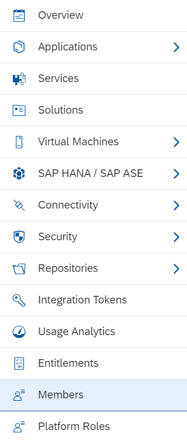
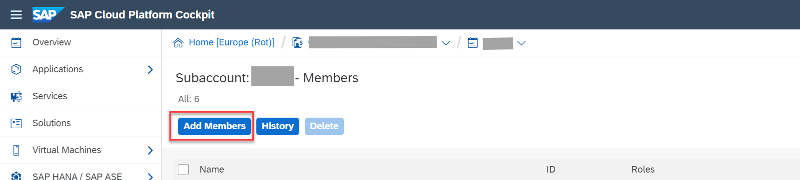
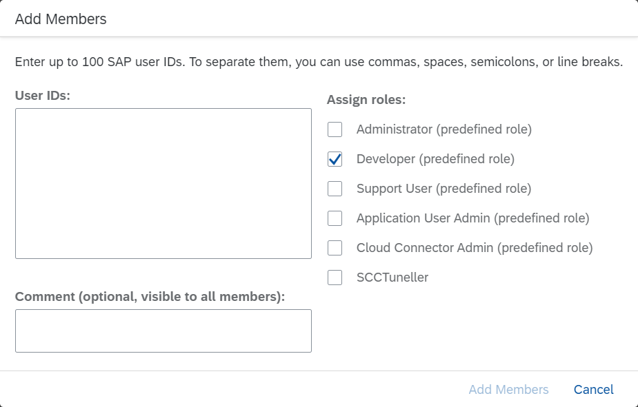

<!-- loio70ebb871459d4f1b999beed27e32abdd -->

# Adding New Administrators \(Optional\)

You specify all users who should get assigned the administrator role for the subaccount.

<a name="loio70ebb871459d4f1b999beed27e32abdd__prereq_svj_lng_t1b"/>

## Prerequisites

You have the Administrator role for the subaccount. You have the user IDs of the members that you want to add.

## Context

SAP grants administrator rights to the S-user ID specified in the order form. This user can grant administrator rights to other users in this subaccount.

## Procedure

1.  In the Cockpit, choose *Members*.

    

2.  Choose *Add Members*.

    

3.  In the *User IDs* field, enter the S-user or P-user IDs of all the users you want to add as administrators. Select the roles *Administrator \(predefined role\)*, *Developer \(predefined role\)*, and *Cloud Connector Admin \(predefined role\)*.

    

<a name="loio70ebb871459d4f1b999beed27e32abdd__postreq_izs_3wg_t1b"/>

## Next Steps

-   The *Cloud Connector Admin* role is not mandatory for all users and depends on your requirements. Check question 16 in the [Security FAQs](security-faqs-58ff94f.md). Also, you may not need the *Cloud Connector Admin* role during onboarding.

-   If you have more than one tenant, you must add members to each tenant separately.
-   For the latest documentation and detailed instructions on how to add members to an account, see [Adding Members to an Account](https://help.sap.com/viewer/368c481cd6954bdfa5d0435479fd4eaf/Cloud/en-US/eb6d612b5e4844d78e2fb796ee9f61e5.html).

