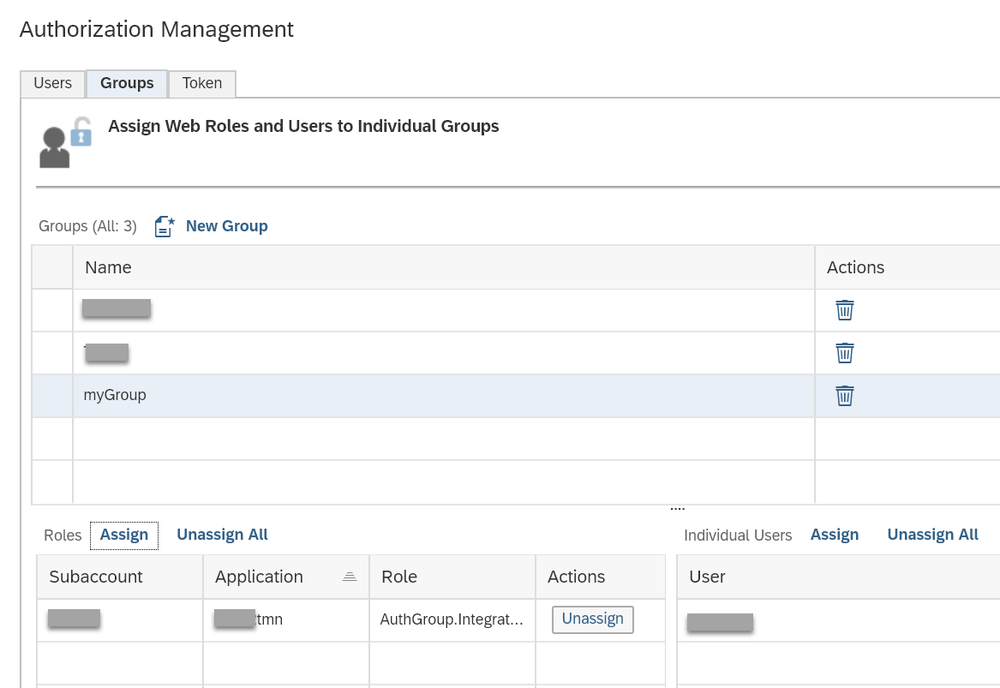

<!-- loio82769d840c8d422c941a407a2243270a -->

# Assigning User Groups and Roles

Associate user groups with authorization groups or roles

## Context

The following procedure shows how to give permissions for a user group.

## Procedure

1.  In SAP BTP Cockpit, select your subaccount and then choose *Security* \> *Authorizations*.

2.  On page *Authorization Management* choose the tab *Groups*** \> *New Group*.

3.  Enter a Group Name \(for example, `myGroup`\) and click *Save*.

4.  Select the newly created group and under *Individual Users* assign users to the group. To assign a user, click *Assign*, enter the user Id and click *Save*.

5.  Under *Roles* assign the authorization groups or roles to the group. Follow the same procedure as described under [Assigning Users and Roles](assigning-users-and-roles-73af55c.md) for step 4.

    

