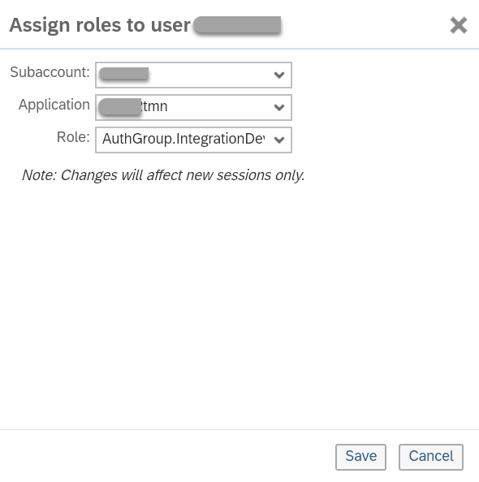

<!-- loio73af55cff75342a8a8ca3a22f22b5283 -->

# Assigning Users and Roles

Associate individual users with authorization groups or roles.

## Context

The following procedure shows how to give permissions for an individual user.

## Procedure

1.  In SAP BTP cockpit, select your subaccount and then choose *Security* \> *Authorizations*.

2.  In field *User* enter the user ID and click *Show Assignments*.

    As expected, no roles are shown.

3.  Click *Assign*.

4.  In dialog *Assign roles to user <user ID\>* specify the following settings:

    Select the relevant *Subaccount* and in *Application*, select the one that ends with `tmn`.

    

    As *Role* select the desired authorization group \(which start with `AuthGroup`\) or role and click *Save*.

    For example, if you like to authorize the user to perform typical integration developer tasks, assign the authorization group *AuthGroup.IntegrationDeveloper*.

    If you like to assign a role \(for example, `ESBMessaging.send`\) to authorize a \(technical\) user to process messages on the tenant,as *Application* you need to select the one that ends with `iflmap`.

5.  Repeat this step for all user-to-role assignments you like to specify.

