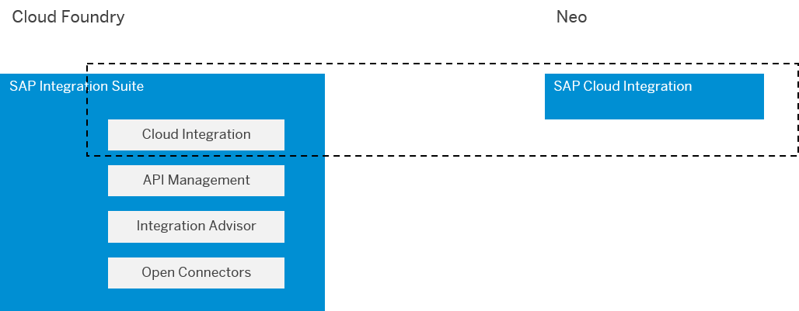

<!-- loio639a0612e32c498fa7480580d90c9ea6 -->

# Environment-Specific Aspects Integration Developers Should Know

Cloud Integration is available in the following Cloud environments: Cloud Foundry and Neo. In both environments, Cloud Integration comprises - with a few exceptions - the same features for integration developers. For the exceptions, see SAP Note [2752867](https://me.sap.com/notes/2752867). However, disregarding these exceptions, some additional aspects that concern the setup of your integration scenarios still depend on the environment. This section provides you, the integration developer and/or tenant administrator, with an overview of the most important aspects that are specific to the environment where you run Cloud Integration.

> ### Note:  
> This information helps people who have operated Cloud Integration in the Neo environment and have migrated it to Cloud Foundry, for example.

<a name="loio639a0612e32c498fa7480580d90c9ea6__section_cfq_sx2_fpb"/>

## Overview

Cloud Integration is operated in a cloud infrastructure: Physically, the software runs in data centers in different regions all over the world.

****

<table>
<tr>
<th valign="top">

Environment

</th>
<th valign="top">

Product Availability

</th>
<th valign="top">

Infrastructure Provider

</th>
</tr>
<tr>
<td valign="top">

Cloud Foundry

</td>
<td valign="top">

Available as Cloud Integration capability of SAP Integration Suite.

SAP Integration Suite comprises these capabilities: Cloud Integration, Integration Advisor, API Management, and Open Connectors. For more information on SAP Integration Suite, see [SAP Integration Suite](https://help.sap.com/viewer/product/SAP_CLOUD_PLATFORM_INTEGRATION_SUITE/sap.cp.integration.suite/en-US). SAP Integration Suite is also available as a trial version, see [Welcome to SAP BTP Trial](https://cockpit.eu10.hana.ondemand.com/trial/#/home/trial). To see how to set up SAP Integration Suite and how to use both capabilities Cloud Integration and API Management together in a simple scenario, check out the scenario [Request Product Details with an Integration Scenario](https://developers.sap.com/mission.cp-starter-integration-cpi.html).

For Cloud Foundry, dedicated service plans are available. Depending on the service plan, some features used in Neo might not be available or only usable in a restricted way in Cloud Foundry. For more information, see SAP Note [2903776](https://launchpad.support.sap.com/#/notes/2903776).

</td>
<td valign="top">

Data centers of the cloud infrastructures of Amazon Web Services, Alibaba Cloud, and Microsoft Azure can be involved.

</td>
</tr>
<tr>
<td valign="top">

Neo

</td>
<td valign="top">

Licensed as stand-alone service, SAP Cloud Integration.

</td>
<td valign="top">

The hardware that processes the messages is located exclusively in one, or multiple data centers owned by SAP.

</td>
</tr>
</table>

> ### Note:  
> In this section, the terms *SAP Cloud Integration* and *Cloud Integration* are used synonymously.

> ### Note:  
> The component architecture differs depending on the cloud environment.
> 
> See:
> 
> [Technical Landscape, Cloud Foundry Environment](../SecurityCF/technical-landscape-cloud-foundry-environment-cc22301.md)
> 
> [Technical Landscape, Neo Environment](../SecurityNeo/technical-landscape-neo-environment-7fec71d.md)

<a name="loio639a0612e32c498fa7480580d90c9ea6__section_mh1_qy2_fpb"/>

## Connection Setup for Inbound Communication

Before starting with integration content design, you need to first set up inbound HTTP connections for the following use cases.

The ways how to configure inbound authentication differ in both environments because you need to enable sender applications to securely access certain resources on SAP BTP.

-   Enabling sender systems to call integration flow endpoints.

    See: [Connection Setup for Inbound Communication - Integration Flow Endpoints](connection-setup-for-inbound-communication-integration-flow-endpoints-bf35cba.md)

-   Enabling an API client to call the Cloud Integration OData API.

    See: [Connection Setup for Inbound Communication - for API Clients](connection-setup-for-inbound-communication-for-api-clients-bc177b4.md)

In the Cloud Foundry environment, for the configuration of the most authentication options, you need to create an SAP BTP service instance. A service instance defines how external components can access a service \(in this case, the Cloud Integration runtime or Cloud Integration resources exposed through the OData API\) of SAP BTP. With a service instance, you define how to access a certain service or resource of SAP BTP, whereas the service key \(generated by a service instance\) contains the information required for a client to access the service \(for example, credentials\). Depending on whether you like to set up a connection to integration flow endpoints or to API resources, you need to specify *integration-flow* or *api* as *plan*. If you've operated Cloud Integration in the Neo environment, these concepts are likely new for you. The following SAP Community blog illustrates the configuration of the mentioned entities when addressing integration flow endpoints: [Integration Suite – Accessing Cloud Integration Runtime](https://blogs.sap.com/2021/03/22/integration-suite-accessing-cloud-integration-runtime/).

<a name="loio639a0612e32c498fa7480580d90c9ea6__section_bvs_w2f_fpb"/>

## User and Authorization Management

See: [User and Authorization Management](user-and-authorization-management-7a70087.md)

<a name="loio639a0612e32c498fa7480580d90c9ea6__section_wl2_xck_4rb"/>

## API-Based Artifacts

In Neo, only the following API-based artifact type is available: OData API.

In Cloud Foundry, certain service plans are available that come with the following API-based artifact types: OData API, REST API, and SOAP API \(see also: SAP Note [2903776](https://launchpad.support.sap.com/#/notes/2903776)\).

<a name="loio639a0612e32c498fa7480580d90c9ea6__section_dkk_c3f_fpb"/>

## Setting Up Content Transport

See: [Setting Up Content Transport](setting-up-content-transport-f4bf46b.md)

<a name="loio639a0612e32c498fa7480580d90c9ea6__section_obh_23f_fpb"/>

## Developing Custom Adapters

See: [Adapter Development](adapter-development-57db422.md)

<a name="loio639a0612e32c498fa7480580d90c9ea6__section_t5x_lhn_fpb"/>

## Audit Logging

See: [Audit Logging](audit-logging-f88d964.md)

<a name="loio639a0612e32c498fa7480580d90c9ea6__section_dgx_gzj_srb"/>

## System Scope

Cloud Integration comes with various options to temporarily store data. The system limits depend on the environment.

See: [What Is SAP Cloud Integration?](../WhatIsCloudIntegration/what-is-sap-cloud-integration-e12c09c.md)

