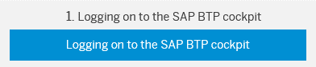
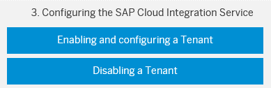
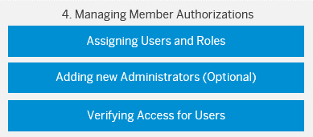

<!-- loioe7b1eaa2246641b3a6188233cf219ab8 -->

# Initial Setup of SAP Cloud Integration in the Neo Environment

This quick start guide provides all the information you need to quickly onboard after subscribing to the SAP Cloud Integration edition.

The following steps tell you how to complete the onboarding:

When you subscribe to any of the SAP Cloud Integration editions, you receive one or two e-mails from SAP, depending on the edition of SAP Cloud Integration that you have purchased. Log on to SAP BTP cockpit with your SAP S-user ID. For more information about the different commercial models, see [https://cloudplatform.sap.com/pricing.html](https://cloudplatform.sap.com/pricing.html).

If you have chosen the subscription-based license model, you don’t need to perform steps 2 \(Creating a Subaccout\) and 3 \(Enabling and Configuring a Tenant\). These actions are already done by SAP. You can go straight to step 4.

Create subaccounts in your global account. This allows you to divide your account model and structure it according to your business needs. You can find the Display Name of your subaccount in the welcome e-mail. For more information about accessing subaccounts, see [Navigate to Global Accounts and Subaccounts](https://help.sap.com/viewer/65de2977205c403bbc107264b8eccf4b/Cloud/en-US/0874895f1f78459f9517da55a11ffebd.html).

-   [Enabling and Configuring a Tenant](enabling-and-configuring-a-tenant-6807119.md)
-   [Disabling a Tenant](disabling-a-tenant-1e0aa96.md)

Enable the *Process Integration* service. Once the process integration service is enabled, you can configure a tenant.

Once you have obtained access to SAP Cloud Integration, you can add new users and assign the required roles to them. Then you can start creating and running your integration flows.

**Related Information**  

[Getting Started with Integration Flow Development](../Development/getting-started-with-integration-flow-development-e5724cd.md "Learn how to develop and run your first integration flow.")

