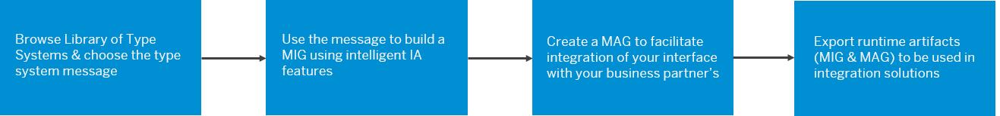

<!-- loio6b9fe2d753534bebadcfa9080228bd94 -->

# SAP Integration Advisor

SAP Integration Advisor is a cloud application that helps you to simplify and streamline the implementation flow of your B2B/A2A and B2G integration process. It uses a crowd-based machine learning approach to help you create integration content easily. Tests indicate that you can speed up the content creation to deployment process by almost 60% using Integration Advisor. You can also manage and share your content, and leverage the content shared by other application users with similar business needs.

> ### Note:  
> SAP Integration Advisor is available on the Cloud Foundry \(CF\) environment. The Interfaces and Mappings designed in Neo environment are also compatible in the CF environment.

Integration Advisor solves the biggest problem that you face in B2B/A2A/B2G integration: multiple business partners who use different industry standards like UN/EDIFACT, SAP IDoc, and ASC X12, to name a few. Each new standard creates a need for a new interface that facilitates this integration, and doing this manually is time consuming. With Integration Advisor, you have a library of type systems that you can use as a starting point. Use the messages in this type system library to create a new message implementation guideline \(MIG\), create mapping guidelines \(MAG\) to map the standard you use in your business system to that of your business partner's, and generate runtime artifacts that you can use in different integration solutions like SAP Cloud Integration and SAP Process Orchestration.

Here is a simple overview of your journey to implement a B2B/A2A/B2G integration:

Here's a short video that gives you a quick overview of SAP Integration Advisor.

> ### Note:  
> This video was created before our branding changes related to SAP technology were announced in January 2021.

**Table of Contents**

-   [Terminology & Glossary for SAP Integration Advisor](terminology-glossary-for-sap-integration-advisor-9c221b4.md)
-   [Subscribing to SAP Integration Advisor](subscribing-to-sap-integration-advisor-6a18444.md)
-   [Library of Type Systems](library-of-type-systems-740136b.md)
-   [Managing Licence for Type Systems](managing-licence-for-type-systems-ed1e961.md)
-   [Message Implementation Guidelines \(MIGs\)](message-implementation-guidelines-migs-f9f2bab.md)
    -   [Creating a New Message Implementation Guideline](creating-a-new-message-implementation-guideline-b894de0.md)
    -   [Working with a Message Implementation Guideline](working-with-a-message-implementation-guideline-9d1c1df.md)

-   [Mapping Guidelines \(MAGs\)](mapping-guidelines-mags-42124f4.md)
    -   [Creating a New Mapping Guideline](creating-a-new-mapping-guideline-a42920e.md)
    -   [Working with a Mapping Guideline \(MAG\)](working-with-a-mapping-guideline-mag-0803ca6.md)

