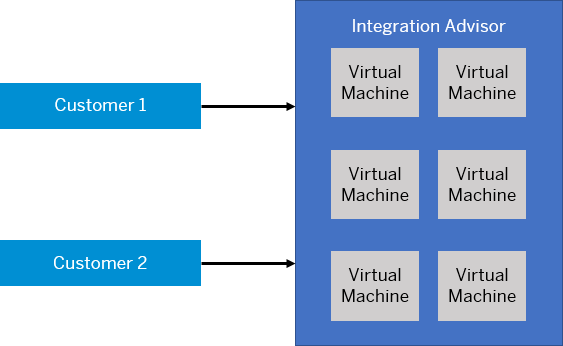

<!-- loio4e30818064ea4df5b6255347f46f845c -->

# Technical Landscape

The technical infrastructure comprises a set of technical components that can communicate with each other and with remote components in a secure way based on HTTPS protocol. In addition, user access to the technical infrastructure is designed in such a way that only users with well-defined permissions can access the different segments.

The following figure shows the high-level technical infrastructure and the main access points and connections. Areas in blue indicate components owned by customers, areas in gray are components that are owned by SAP \(in most cases\).

<a name="loio4e30818064ea4df5b6255347f46f845c__section_ank_p5s_ngb"/>

## Components and Communication Paths

In technical terms, the integration platform is designed as a cluster of virtual machines \(nodes\) that runs within the SAP cloud. Although all users that connect to the platform through the Internet share the same physical infrastructure, each customer gets access to only one or more dedicated parts of the platform: accounts or tenants.

On each tenant, a clustered, virtual integration runtime is installed \(referred to as a tenant cluster\). Tenants are strictly isolated from each other with regard to their resources \(such as CPU and memory\) and to the data that is processed on them. Strictly speaking, each tenant stores data in a separate database schema \(this is referred to as tenant isolation\).

At runtime, the integration platform processes data that is exchanged between the involved participants on a cluster of different virtual machines hosted in the SAP Cloud. A cluster associated with a specific tenant is referred to as a tenant cluster.

> ### Note:  
> A virtual machine \(VM\) is a software implementation of a machine that executes a program like a physical machine.

The integration platform is designed in such a way that the involved virtual machines are strictly separated from each other with regard to the related customers. In other words, separate resources \(memory, CPU, and file system\) of the cloud-based integration platform are allocated to each customer \(even though all customers might share the same hardware\). In addition, each tenant uses a separate database schema, which guarantees that the data of the different customers is strictly separated. This separation is also referred to as tenant isolation.

The following figure illustrates this concept for two customers communicating with each other:

<a name="loio4e30818064ea4df5b6255347f46f845c__section_kzs_2xs_ngb"/>

## User Access

In addition to the above mentioned components that interact with each other when messages are being processed and exchanged between the involved systems, additional components come into play when a dialog user accesses the infrastructure \(for example, when an administrator accesses monitoring data or when an integration developer deploys an integration artifact\).

People with different roles can access the infrastructure – both on the SAP side \(as the provider of the integration infrastructure\) and on the customer side. Human access points \(for dialog users\) are:

• Dedicated experts at SAP access the infrastructure to provide a tenant cluster for the customer.

• Experts on the customer side access the infrastructure to design and deploy integration content and to monitor an integration scenario at runtime \(integration developers and tenant administrators\).

<a name="loio4e30818064ea4df5b6255347f46f845c__section_kc3_kct_ngb"/>

## Data Storage

SAP Integration Advisor is mainly a design time tool, which essentially means that the application itself does not have a runtime server where you deploy the artifacts designed using the application. Rather, you deploy the artifacts on SAP Cloud Integration or other applications.

For SAP Cloud Integration security guidelines, please refer to: [Technical Landscape, Neo Environment](../SecurityNeo/technical-landscape-neo-environment-7fec71d.md) in SAP Cloud Integration documentation.

