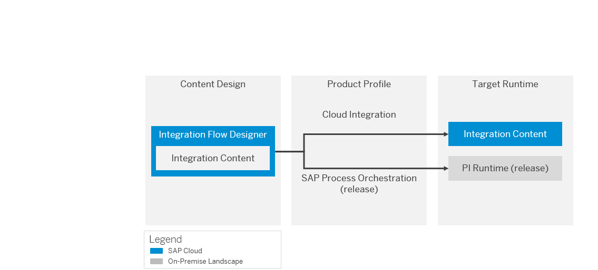

<!-- loio8007daa7b193409580ba151b1df77fa4 -->

# Runtime Profiles

Cloud Integration allows you to use integration content for different target integration platforms. Accordingly, different runtime profiles are available to adapt the user interface of the integration content designer to the specifications and capabilities of the target integration platform.

A **runtime profile** defines a set of capabilities for Cloud integration content design supported by a specific target integration platform. In particular, a specific runtime profile supports the configuration of a specific set of adapter types and integration flow steps.

The following runtime profiles are available:

-   **Cloud Integration**

    Cloud-based integration runtime of Cloud Integration

-   **SAP Process Orchestration \(for specific Process Orchestration release\)** 

    For example: **SAP Process Orchestration 7.5, SP5**

    On premise integration runtime of SAP Process Integration \(for the available release\)

Prior to start working with Cloud integration content, you need to know on which target integration platform\(s\) the Cloud integration content is to be deployed and executed.

If you encounter use cases where both on premise and Cloud-based integration platforms are involved, you might like to have several options and, accordingly, both runtime profiles are of interest for you.

The following figure illustrates the use case for the runtime profiles SAP Cloud Integration and SAP Process Orchestration 7.5 SP0.

When you’ve decided on the runtime profiles in question, the process is as follows:

Based on your choice, you request an account and tenant at SAP.

Under *Settings*, you choose the default runtime profile. When you create a new integration flow, this choice is applied by default.

All the profiles are visible in the *Runtime Profiles* tile. You can enable or disable the availability of the runtime profile in the tenant under the enable option. Only enabled runtime profiles appear in the integration flow under *Runtime Configuration*.

> ### Note:  
> -   Runtime profiles are shown as enabled under *Settings*.
> 
> -   Using the switch option, tenant administrator can enable or disable runtime profiles. Users can edit the profiles page and save the settings.
> 
> -   The Cloud Integration profile can’t be disabled. The switch option is grayed out.
> 
> -   Tenant administrator can decide to enable or disable the *SAP Process Orchestration* supported packages \(SP's\). They can take the decision based on the availability of SP’s in the on-premise integration platform.
> 
> -   If you make support packages of *SAP Process Orchestration* profile as a default and disable it, SAP Cloud Integration automatically becomes a default profile.
> 
> -   If you disable the runtime profile already used in the integration flow
> 
>     -   The palette shows an alert message indicating that the runtime profile set in the integration flow isn’t available; default profile set at the workspace level will be used for loading the palette and validations.
>     -   Disabled runtime profile is grayed out in the integration flow under *Runtime Configuration*.

The integration flow editor shows the options and executes checks based on the chosen runtime profile. The reason for this is that the target integration platform imposes specific restrictions on the Cloud integration content.

You have the option to configure a runtime profile also for an individual integration flow \(under *Runtime Configuration*\).

**Related Information**  

[Set Default Runtime Profile](set-default-runtime-profile-efebd50.md "The tenant administrator can view and configure a runtime profile, to mark one of them as default for the tenant.")

[Configure Runtime Profile for an Integration Flow](configure-runtime-profile-for-an-integration-flow-65cc0bc.md "You can use runtime profile in an integration flow, to develop content for a particular runtime.")

