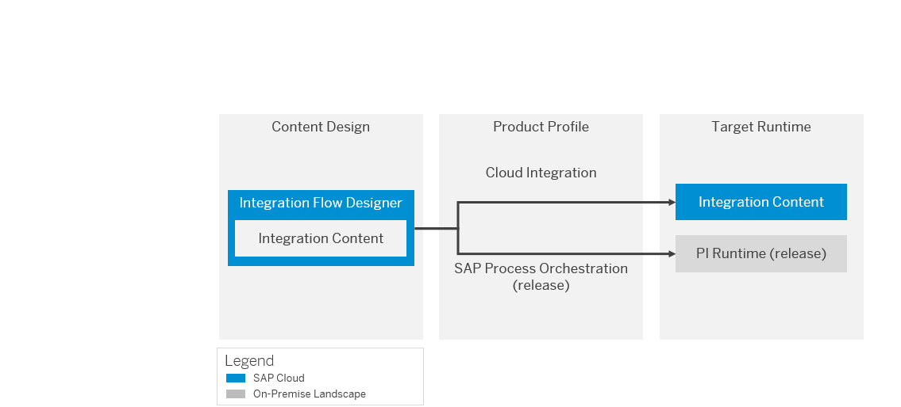

<!-- loio8007daa7b193409580ba151b1df77fa4 -->

# Runtime Profiles

Cloud Integration allows you to design integration content for different target integration platforms. Accordingly, different runtime profiles are available to adapt the user interface of the integration content designer to the specifications and capabilities of the target integration platform.

A **runtime profile** defines a set of capabilities for content design supported by a specific target integration platform. In particular, a specific runtime profile supports the configuration of a specific set of integration flow steps, APIs, and adapter types.

The following runtime profiles are available:

**Runtime Profiles**

<table>
<tr>
<th valign="top">

Runtime Profile

</th>
<th valign="top">

Description

</th>
<th valign="top">

Supported Artifacts

</th>
<th valign="top">

Important Links

</th>
</tr>
<tr>
<td valign="top">

**Cloud Integration** 

</td>
<td valign="top">

Cloud-based integration runtime of Cloud Integration 

</td>
<td valign="top">

See  <?sap-ot O2O class="- topic/xref " href="bf932e05ece44c4d8911770074441278.xml" text="" desc="" xtrc="xref:1" xtrf="file:/home/builder/src/dita-all/zpk1713331951414/loio3268cb35959d4b368fb49de861bfe8a1_en-US/src/content/localization/en-us/8007daa7b193409580ba151b1df77fa4.xml" output-class="" outputTopicFile="file:/home/builder/tp.net.sf.dita-ot/2.3/plugins/com.elovirta.dita.markdown_1.3.0/xsl/dita2markdownImpl.xsl" ?>  

</td>
<td valign="top">

</td>
</tr>
<tr>
<td valign="top">

**SAP Process Orchestration** 

\(for a specific Process Orchestration release, for example: **SAP Process Orchestration 7.5, SP05**\)

</td>
<td valign="top">

On-premise integration runtime of SAP Process Integration

</td>
<td valign="top">

</td>
<td valign="top">

</td>
</tr>
</table>

> ### Tip:  
> To display and manage runtime profiles, choose *Settings* \> *Integrations*. When you select a runtime profile, the features enabled and supported by that profile are displayed. That way, you can find out which component versions \(for example, which version of a dedicated adapter\) are supported by the selected runtime profile.
> 
> If you apply a runtime profile to an integration flow, the integration flow editor restricts you to configuring only the supported features.

Before start working with and designing integration content, you must know on which target runtime you want to deploy the integration content.

All the profiles appear in the *Runtime Profiles* tab. You can enable or disable a runtime profile based on your requirements. Only the enabled runtime profiles appear in the *Runtime Configuration* tab of the integration flow editor.

> ### Note:  
> -   At any point of time, there's only one Cloud Integration runtime profile and you can’t disable it. The option to disable this profile is grayed out.
> 
> -   The runtime profiles can’t be disabled. The *Current Version* column displays the version on which the runtime profile is currently running.
> 
> -   The runtime profiles are updated at cloud speed, which means you must upgrade them monthly. If your runtime is outdated, content deployment and undeployment get blocked. For more information, see  <?sap-ot O2O class="- topic/xref " href="27c3926556e340d49628fd914dcba5b8.xml" text="" desc="" xtrc="xref:5" xtrf="file:/home/builder/src/dita-all/zpk1713331951414/loio3268cb35959d4b368fb49de861bfe8a1_en-US/src/content/localization/en-us/8007daa7b193409580ba151b1df77fa4.xml" output-class="" outputTopicFile="file:/home/builder/tp.net.sf.dita-ot/2.3/plugins/com.elovirta.dita.markdown_1.3.0/xsl/dita2markdownImpl.xsl" ?> .
> 
> -   Tenant administrator can decide to enable or disable the *SAP Process Orchestration* supported packages \(SPs\). They can take the decision based on the availability of SPs in the on-premise integration platform.
> 
> -   If you make an *SAP Process Orchestration* runtime as the default profile and disable it, Cloud Integration automatically becomes the default profile.
> 
> -   If you disable a runtime profile that is already used in an integration flow, the integration flow editor sends an alert message indicating that the runtime profile isn’t available. The default runtime profile is automatically used for validations.

The following figure illustrates a use case for the runtime profiles SAP Cloud Integration and SAP Process Orchestration 7.5 SP0.

When you’ve decided on the runtime profile in question, follow the steps mentioned in [Set Default Runtime Profile](set-default-runtime-profile-efebd50.md).

You have the option to configure a runtime profile also for an individual integration flow \(under *Runtime Configuration*\). See: [Configure Runtime Profile for an Integration Flow](configure-runtime-profile-for-an-integration-flow-65cc0bc.md)

