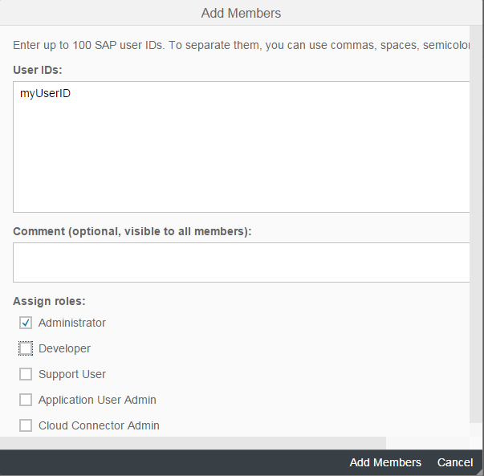

<!-- loioeb6d612b5e4844d78e2fb796ee9f61e5 -->

# Adding Members to an Account

You specify the members of the account to define who is involved in an integration project.

## Context

Perform the following steps.

## Procedure

1.  To specify all users who should get assigned the tenant administrator role, open the SAP BTP cockpit using the S-user ID provided to you by SAP \(in the mail that contains also the information on the account\).

2.  Choose *Members*** \> *Add Members*.

3.  Enter the user ID.

4.  Select the role which should be assigned to the user.

    

    Assign role *Administrator* to the user who is supposed to have the full permissions of an administrator.

    Assign role *Application User Admin* to the user who is supposed to have restricted administrator permissions.

    > ### Note:  
    > These roles are **not** specific to any tasks related to integration projects.
    > 
    > When you define more specific authorizations for integration team members, you assign other roles \(as described in the corresponding section\).

5.  Choose *Add Members*.

**Related Information**  

[Defining Authorizations for Integration Team Members](defining-authorizations-for-integration-team-members-3ec7679.md "To authorize selected people to work on the account as part of the integration team in the context of SAP Cloud Integration (for example, as integration developers), you assign roles to the associated users.")

[Persona](../SecurityNeo/persona-2937e5c.md "When you perform user management tasks using SAP BTP SAP BTP cockpit, you find a set of predefined roles that you can assign to users of the account. According to the main tasks associated with integration projects, these roles are associated to certain persona relevant for an integration project.")

[Support Tasks](support-tasks-01f4d21.md "")

