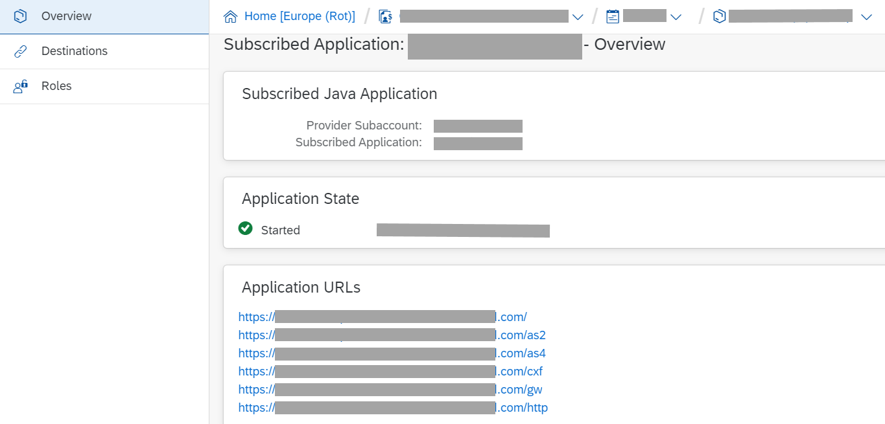

<!-- loiode848be89bfa4fb1a570f5b526ba2527 -->

# Application URLs, Neo Environment

> ### Note:  
> This information is relevant only when you use SAP Cloud Integration in the Neo environment.

Application URLs provide various options to connect to the SAP Cloud Integration virtual environment.

Application URLs are defined both for the tenant management node application and for the runtime node application.

The following table provides a summary of the available application URLs:

**Application URLs**

<table>
<tr>
<th valign="top">

Node Type

</th>
<th valign="top">

Application URL

</th>
<th valign="top">

Description

</th>
</tr>
<tr>
<td valign="top">

Tenant management node

</td>
<td valign="top">

`http://<tenant management node address>/Operations` 

</td>
<td valign="top">

Operations URL to be used when connecting to the tenant using Eclipse \(for example, when using the Adapter Development Kit\)

</td>
</tr>
<tr>
<td valign="top">

Tenant management node

</td>
<td valign="top">

`http://<tenant management node address>/api` 

</td>
<td valign="top">

Base URL to access the SAP Cloud Integration application programming interface \(API\)

Note that the SAP Cloud Integration OData API is published on the SAP Business Accelerator Hub at:

[https://api.sap.com/shell/discover/contentpackage/CloudIntegrationAPI](https://api.sap.com/shell/discover/contentpackage/CloudIntegrationAPI)

</td>
</tr>
<tr>
<td valign="top">

Tenant management node

</td>
<td valign="top">

`http://<tenant management node address>/itspaces` 

</td>
<td valign="top">

Web UI URL for the tenant \(for dialog users to design integration flows, monitor message processing, and execute additional tasks within an integration project\)

</td>
</tr>
<tr>
<td valign="top">

Tenant management node

</td>
<td valign="top">

`http://<tenant management node address>/cxf` 

</td>
<td valign="top">

Endpoint address under which SAP Solution Manager can retrieve alert notifications \(if configured accordingly\)

</td>
</tr>
<tr>
<td valign="top">

Runtime node

</td>
<td valign="top">

`http://<runtime node address>/as2` 

</td>
<td valign="top">

AS2 sender adapter endpoint base URL

</td>
</tr>
<tr>
<td valign="top">

Runtime node

</td>
<td valign="top">

`http://<runtime node address>/cxf` 

</td>
<td valign="top">

SOAP sender adapter endpoint base URL

</td>
</tr>
<tr>
<td valign="top">

Runtime node

</td>
<td valign="top">

`http://<runtime node address>/gw/odata` 

</td>
<td valign="top">

OData endpoint URL

</td>
</tr>
<tr>
<td valign="top">

Runtime node

</td>
<td valign="top">

`http://<runtime node address>/http` 

</td>
<td valign="top">

HTTPS sender adapter endpoint base URL

For example, assume that you have configured an integration flow with an HTTPS sender adapter and as *Address* you have specified the following value: `/myEndpoint`. Then an HTTP client can call this integration flow through the following endpoint address:

`http://<tenant address>/http/myEndpoint`

</td>
</tr>
</table>

> ### Note:  
> To display the available application URLs, open the subaccount, select *Applications* \> *Subscriptions*, and then the required application \(either the tenant management node application ending with `tmn` or the runtme node application ending with `iflmap`\).
> 
> 

