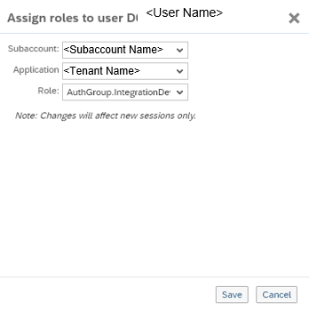

<!-- loio3ec767915f4b4cf894413971c8376ca5 -->

# Defining Authorizations for Integration Team Members

To authorize selected people to work on the account as part of the integration team in the context of SAP Cloud Integration \(for example, as integration developers\), you assign roles to the associated users.

## Context

> ### Remember:  
> There are currently certain limitations when working in the Cloud Foundry environment. For more information on the limitations, see SAP Note [2752867](https://me.sap.com/notes/2752867).

Authorizations can also be given to users that are not associated with any integration team member \(for example a user associated with a system that is to be authorized to send a message to Cloud Integration\).

Perform the following steps for all users for which to assign authorizations.

> ### Note:  
> You can also define **Role Collections** and assign roles to role collections. That way, you can assign roles at once for all users who should to get identical permissions on the account.

> ### Note:  
> SAP has provided you with the link to access SAP BTP cockpit.

## Procedure

1.  In SAP BTP cockpit, select your subaccount and then choose *Security* \> *Authorizations*. Enter your user ID, and choose *Assign*.

2.  In the navigation pane, choose *Security*** \> *Authorizations*.

3.  If you like to first create a user group, on page *Authorization Management* choose the tab *Groups*.

    Enter a group name and add the relevant users to it \(as shown in the figure\).

4.  On page *Authorization Management* enter the user group or user for which you like to assign authorization groups.

    

5.  Choose *Assign*.

6.  On page *Assign Roles to User <User Name\>* choose the authorization group to be assigned.

    

    You can assign groups of roles \(also referred to as **authorization groups** and starting with *AuthGroup*\) or individual roles. Authorization groups cover the different tasks associated with an integration project.

    As *Application*, choose the one which ends with *tmn* \(for tenant management node\).

7.  Choose *Save*.

**Related Information**  

[Persona](../SecurityNeo/persona-2937e5c.md "When you perform user management tasks using SAP BTP SAP BTP cockpit, you find a set of predefined roles that you can assign to users of the account. According to the main tasks associated with integration projects, these roles are associated to certain persona relevant for an integration project.")

 <?sap-ot O2O class="- topic/link " href="289ef3f8cfad442ea86fe0d5ddad8c42.xml" text="" desc="" xtrc="link:2" xtrf="file:/home/builder/src/dita-all/cvv1690968981196/loio3268cb35959d4b368fb49de861bfe8a1_en-US/src/content/localization/en-us/3ec767915f4b4cf894413971c8376ca5.xml" ?> 

