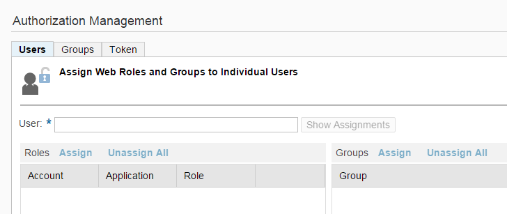
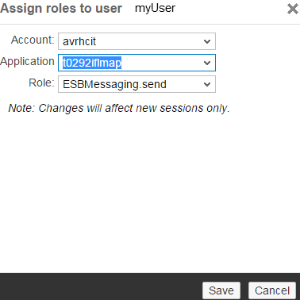

<!-- loio24585cc503334e6c917ef383efb5558a -->

# Defining Permissions for Senders to Process Messages on a Runtime Node

## Context

> ### Remember:  
> There are currently certain limitations when working in the Cloud Foundry environment. For more information on the limitations, see SAP Note [2752867](https://me.sap.com/notes/2752867).

> ### Note:  
> SAP has provided you with the link to access SAP BTP Cockpit.

> ### Note:  
> In order to authorize a sender system to call a tenant \(using HTTPS/basic authentication\) and to get messages processed on the tenant, you need to assign to the associated technical user the specific role *ESBmessaging.send*.

## Procedure

1.  In SAP BTP cockpit, select your subaccount and then choose *Security* \> *Authorizations*. Enter your user ID, and choose *Assign*.

2.  In the navigation pane, choose *Security*** \> *Authorizations*.

3.  On page *Authorization Management*, enter the user for which you like to define the permission.

    

4.  Choose *Assign*.

5.  As *Application*, choose the one, which ends with *iflmap* \(corresponding to a runtime node of the cluster that actually is in charge of processing the message\).

6.  Select the role *ESBmessaging.send*.

    

<a name="loio24585cc503334e6c917ef383efb5558a__postreq_c4y_zhn_2db"/>

## Next Steps

> ### Note:  
> When configuring inbound authorization settings in the corresponding sender adapter, you can keep the role name *ESBmessaging.send* pre-entered by default in the *User Role* field \(when you have for *Authorization* selected the option *User Role*\).

Alternatively, you can define a custom role for the runtime node by performing the following steps:

1.  Select your subaccount.

2.  Choose *Subscriptions*.

3.  Under *Application*, select the one ending with *iflmap* \(for your runtime node\).

4.  Choose *Roles*.

5.  Choose *New Role* and enter the name of your custom role.

    > ### Note:  
    > When creating a new user role, be aware of the fact that for role names in the Cloud Foundry environment there are certain restrictions. In the Cloud Foundry environment, only the following characters are allowed in user role names:
    > 
    > -   a-z
    > 
    > -   A-Z
    > 
    > -   0-9
    > 
    > -   \_
    > 
    >     \(underscore\)
    > 
    > -   .
    > 
    >     \(period\)
    > 
    > 
    > If you don't consider these restrictions when creating a new role in the Neo environment \(as described here\), you run into problems when migrating your integration content to the Cloud Foundry environment.

> ### Note:  
> When configuring inbound authorization settings in the corresponding sender adapter, you have to enter this role name in the *User Role* field \(when you have for *Authorization* selected the option *User Role*\).

