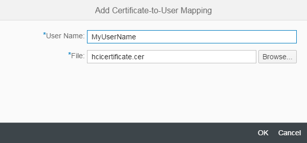

<!-- loio88ea2e5336d445f783c194c8d2780d35 -->

<link rel="stylesheet" type="text/css" href="../css/sap-icons.css"/>

# Managing Certificate-to-User Mappings, Neo Environment

The *Manage Security* area provides an overview of security-related artifacts. It also provides access to all certificate-to-user mappings defined for the tenant.

> ### Note:  
> This information is relevant only when you use SAP Cloud Integration in the Neo environment.

You can display all certificate-to-user mappings deployed on the tenant by clicking the *Certificate-to-User Mapping* tile under *Manage Security Material*.

## Certificate-to-User Mapping Overview

A list of certificate-to-user mappings is displayed in a table. For each artifact, the following attributes are displayed:

**Attributes of Certificate-to-User Mapping Artifacts**

<table>
<tr>
<th valign="top">

Attribute

</th>
<th valign="top">

Description

</th>
</tr>
<tr>
<td valign="top">

*User Name* 

</td>
<td valign="top">

Name of the user to which the certificate is to be mapped

</td>
</tr>
<tr>
<td valign="top">

*Subject DN* 

</td>
<td valign="top">

Indicates the subject distinguished name \(DN\) which entails information about the owner of the certificate such as the common name of the certificate owner \(CN\), the organization \(O\), or the country or region \(C\).

</td>
</tr>
<tr>
<td valign="top">

*Issuer DN* 

</td>
<td valign="top">

Indicates the Issuer distinguished name \(DN\) which entails information about the issuer of the certificate such as common name of the certificate issuer \(CN\), the organization \(O\), or the country or region \(C\).

</td>
</tr>
<tr>
<td valign="top">

*Serial Number* 

</td>
<td valign="top">

Unique serial number of the certificate

</td>
</tr>
<tr>
<td valign="top">

*Valid Until* 

</td>
<td valign="top">

Time when the certificate expires

</td>
</tr>
<tr>
<td valign="top">

*Last Modified by* 

</td>
<td valign="top">

Name of user who has modified the certificate-to-user mapping the last time

</td>
</tr>
<tr>
<td valign="top">

*Last Modified on* 

</td>
<td valign="top">

Date and time when certificate-to-user mapping has been modified the last time

</td>
</tr>
</table>

> ### Note:  
> Limit for certificate-to-user mapping \(when using the Neo environment\): 2 MB \(corresponds to about 2000 X.509 certificates\)

To sort and filter the content of the table, choose *Table Settings* \(:gear:\). On the subsequent screen, you can define how the table entries are to be sorted \(by specifying an attribute and whether the entries are to be sorted for that attribute in ascending or descending order\). You can also filter the table entries for certain attributes.

The search allows you to filter specific certificate-to-user mappings by providing parts of their name.

## Actions

To add a new artifact, perform the following steps:

1.  Choose *Add*.

2.  Specify the *User Name* and \(next to the *File* field\) click *Browse* and search for the certificate file \(.cer file\) on your computer.

    

3.  Choose *OK*.

To edit an existing Certificate-to-User Mapping artifact, perform the following steps:

1.  Select the artifact in the table and choose *Edit*.

2.  You have the options to change the User Name, specify \(select\) another certificate, or to change both attributes.

You can also delete an artifact.

**Related Information**  

[X.509 Certificates](../ConnectionSetup/x-509-certificates-8d38a83.md "X.509 certificates (that comply with the X.509 standard) are used for transport-level security TLS and for message-level security using PKCS#7, WS-Security, and XML Digital Signature.")

[Client Certificate Authentication and Certificate-to-User Mapping \(Inbound\), Neo Environment](../ConnectionSetup/client-certificate-authentication-and-certificate-to-user-mapping-inbound-neo-environment-4b5afdd.md "This option includes an authentication step based on a digital client certificate and the mapping of the certificate to a user.")

