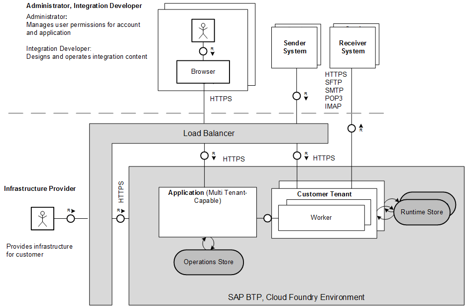

<!-- loiocc22301edf174cc9bf7337c6c66fb704 -->

# Technical Landscape, Cloud Foundry Environment

The technical infrastructure comprises a set of technical components that can communicate with each other and with remote components in a secure way \(using certain protocols such as HTTPS or SFTP, for example\).

> ### Note:  
> This information is relevant only when you use SAP Cloud Integration in the Cloud Foundry environment.

<a name="loiocc22301edf174cc9bf7337c6c66fb704__section_onr_qtw_vgb"/>

## Components and Communication Paths

In technical terms, the integration platform is designed as a containerized and clustered integration platform in the cloud. Messages processed by integration flows from different customers are handled on different *parts* of the platform \(referred to as tenants\).

Tenants processing integration flows from different customers are strictly separated from each other in terms of CPU, data storage, and user access.

The following figure shows a bird's eyes view on the technical architecture.

These are the basic constituents of the virtual platform:

-   A multi tenant-capable application comprises a set of microservices \(not depicted in the figure\) that accomplish tasks related to the management of a tenant and the preparation of monitoring data. It takes requests from the dialog users \(for example, when an integration developer deploys an integration flow using the Web user interface\).

    These microservices run on an application that can be shared across multiple customer tenants.

-   A worker \(runtime container\) processes messages that are exchanged with external systems. Therefore, the worker is connected to the external systems. In other words, workers process customer data that might be confidential and has to be protected.

    Workers are operated within customer-specific tenants. These tenants are strictly separated from each other.

As a consequence of this cluster design, the following main communication paths are active during the operation of an integration scenario:

-   Communication of tenant cluster and remote components

    You can use both cloud systems and on-premise systems \(such as on-premise SAP systems\) as remote components.

    Remote receiver systems are directly connected to a worker through a protocol, which depends on the type of the designed receiver adapter.

    If the integration platform communicates with an on-premise receiver system, you can interconnect the SAP Cloud Connector. This component runs as on-premise agent in a secured network and acts as a reverse invoke proxy between the on-premise network and SAP Cloud Integration. Due to its reverse invoke support, you don't need to configure the on premise firewall to allow external access from the cloud to internal systems.

    For inbound communication from a sender targeting Cloud Integration, a load balancer is interconnected between remote sender systems and the involved SAP BTP components. The load balancer terminates incoming Transport Layer Security \(TLS\) requests and establishes new ones.

Various secure technical protocols can be used for these communication paths. Depending on the adapter type, the following protocols are available:

-   Hyper Text Transfer Protocol \(HTTP\) over Transport Layer Security \(TLS\), which is referred to as HTTPS

-   SSH File Transfer Protocol \(SFTP\) for the exchange of data with an SFTP server

-   Simple Mail Transfer Protocol \(SMTP\), Post Office Protocol \(POP\)3, and Internet Message Access Protocol \(IMAP\) for the exchange of data with mail servers

<a name="loiocc22301edf174cc9bf7337c6c66fb704__section_v5q_lyn_cz"/>

## User Access

Additional components come into play when a dialog user accesses the infrastructure \(for example, when an administrator accesses monitoring data or when an integration developer deploys an integration artifact\).

People with different roles can access the infrastructure – both on the side of the infrastructure provider and on the customer side. Human access points \(for dialog users\) are:

-   Dedicated experts at the side of the infrastructure provider need access to the infrastructure \(for example, to provide a tenant for the customer\).

-   Experts on the customer side access the infrastructure to design and deploy integration content and to monitor an integration scenario at runtime \(integration developers and tenant administrators\).

