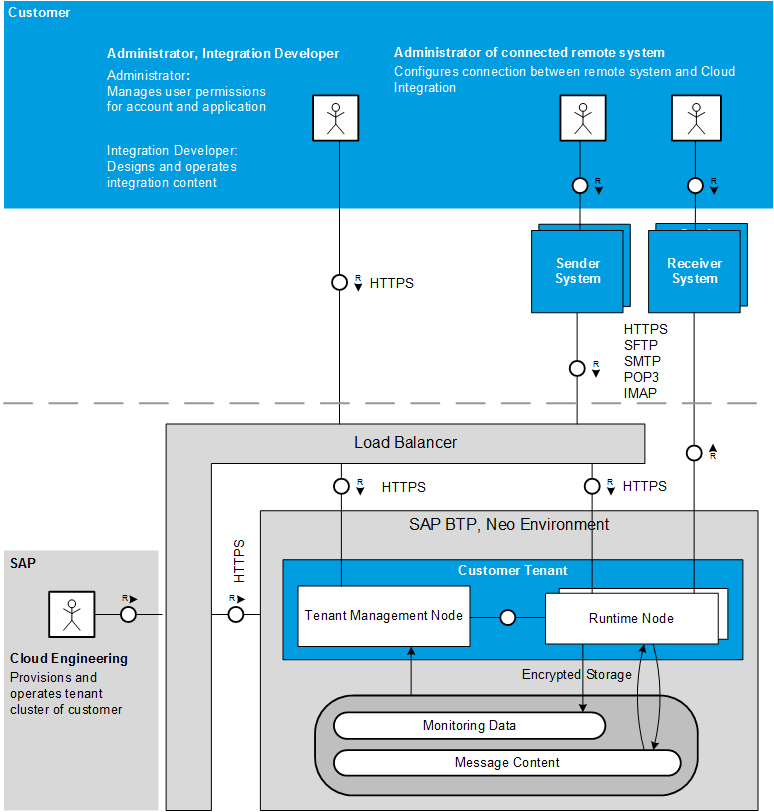

<!-- loio7fec71dcde4b42e68503d5aa6657f602 -->

# Technical Landscape, Neo Environment

The technical infrastructure comprises a set of technical components that can communicate with each other and with remote components in a secure way based on certain protocols such as HTTPS or SFTP, for example. In addition, user access to the technical infrastructure is designed in such a way that only users with well-defined permissions can access the different segments.

> ### Note:  
> This information is relevant only when you use SAP Cloud Integration in the Neo environment.

The following figure shows the high-level technical infrastructure and the main access points and connections. Areas in blue indicate components owned by customers, areas in gray are components that are owned by SAP \(in most cases\).

## Components and Communication Paths

In technical terms, the integration platform is designed as a cluster of virtual machines \(nodes\) that runs within the SAP cloud. Although all users that connect to the platform through the Internet share the same *physical* infrastructure, each customer gets access to only one or more dedicated *parts* of the platform: accounts or tenants.

On each tenant, a clustered, virtual integration runtime is installed \(referred to as a *tenant cluster*\). Tenants are strictly isolated from each other with regard to their resources \(such as CPU and memory\) and to the data that is processed on them. Strictly speaking, each tenant stores data in a separate database schema \(this is referred to as *tenant isolation*\).

At runtime, the integration platform processes data that is exchanged between the involved participants on a cluster of different virtual machines hosted in the cloud. A cluster associated with a specific tenant is referred to as a **tenant cluster**.

> ### Note:  
> A virtual machine \(VM\) is a software implementation of a machine that executes a program like a physical machine.

The integration platform is designed in such a way that the involved virtual machines that process messages at runtime are strictly separated from each other with regard to the related customers. This separation is referred to as *tenant isolation*.

The following figure illustrates this concept for two customers communicating with each other:

The constituents of a tenant cluster are tenant management nodes and runtime nodes.

-   A tenant management node accomplishes tasks related to the management of a tenant cluster. It takes requests from the dialog users \(for example, when an integration developer deploys an integration flow using the Web user interface\). The tenant management node also manages the runtime nodes.

-   A runtime node processes messages that are exchanged with external components. Therefore, the runtime node is connected to the external systems. In other words, runtime nodes process customer data that might be confidential and has to be protected.

Typically, one tenant management node has one or more runtime nodes assigned to it. However, in order to support failover scenarios, more than one tenant management node can be operated in a tenant cluster.

As a consequence of this cluster design, the following main communication paths are active during the operation of an integration scenario:

-   Communication of tenant cluster and remote components

    You can use both cloud systems and on-premise systems \(such as on-premise SAP systems\) as remote components.

    Remote receiver systems are directly connected to the runtime node through a protocol, which depends on the type of the designed receiver adapter. If the integration platform communicates with an on-premise receiver system, you can interconnect the SAP Cloud Connector. This component runs as on premise agent in a secured network and acts as a reverse invoke proxy between the on premise network and SAP Cloud Integration. Due to its reverse invoke support, you don't need to configure the on premise firewall to allow external access from the cloud to internal systems.

    For communication in the opposite direction, a load balancer is interconnected between remote sender systems and the involved SAP BTP components. The load balancer terminates incoming Transport Layer Security \(TLS\) requests and establishes new ones.

-   Communication within a tenant cluster: Within a tenant cluster, the tenant management nodes and runtime nodes communicate with each other through a messaging service.

    The internal network only allows specific communication \(HTTPS\) from one virtual machine to another, and this only by taking the loop to the load balancer \(not depicted in the figure\).

Various secure technical protocols can be used for these communication paths. Depending on the adapter type, the following protocols are available:

-   Hyper Text Transfer Protocol \(HTTP\) over Transport Layer Security \(TLS\), which is referred to as HTTPS

-   SSH File Transfer Protocol \(SFTP\) for the exchange of data with an SFTP server

-   Simple Mail Transfer Protocol \(SMTP\), Post Office Protocol \(POP\)3, and Internet Message Access Protocol \(IMAP\) for the exchange of data with mail servers

Mutual TLS \(mTLS\) is equivalent to client certificate authentication. While setting up the TLS connection, client and server exchange certificates. With mTLS, not only server certificates, but also client certificates are validated based on the signatures provided by certification authorities. For more information, see [Client Certificate Authentication \(Outbound\)](../ConnectionSetup/client-certificate-authentication-outbound-c4e4a15.md) and [Keystore](../ConnectionSetup/keystore-b163513.md).

> ### Note:  
> **Note regarding the timeout behavior for HTTP communication:**
> 
> In HTTP communication spanning multiple components \(for example, from a sender, through the load balancer, to a Cloud Integration tenant, and from there to a receiver\), the actual timeout period is influenced by each of the timeout settings of the individual components that are interconnected between sender and receiver \(precisely spoken, of those components that can control the Transmission Control Protocol \(TCP\) session\). The component or device with the lowest number set for the idle session timeout will determine the timer that will be used.
> 
> -   When considering inbound communication \(through HTTP-based sender adapters\), note that in particular the load balancer has an own timeout setting that has an influence on the overall timeout. For the inbound side, SAP Cloud Integration supports no communication that waits for longer than 10 minutes.
> 
> -   When considering outbound communication, note that in the involved HTTP-based receiver channel you can configure a dedicated timeout. However, timeout setting has no influence on the TCP timeout when the receiver or any additional component interconnected between the Cloud Integration tenant and the receiver have a lower timeout. For example, consider that you have configured a receiver channel timeout of 10 minutes and there is another component involved with a timeout of 5 minutes. In case, nothing is transferred for a certain time, the connection will be closed after the 5th minute.

<a name="loio7fec71dcde4b42e68503d5aa6657f602__section_v5q_lyn_cz"/>

## User Access

In addition to the above mentioned components that interact with each other when messages are being processed and exchanged between the involved systems, additional components come into play when a dialog user accesses the infrastructure \(for example, when an administrator accesses monitoring data or when an integration developer deploys an integration artifact\).

People with different roles can access the infrastructure – both on the SAP side \(as the provider of the integration infrastructure\) and on the customer side. Human access points \(for dialog users\) are:

-   Dedicated experts at SAP access the infrastructure to provide a tenant cluster for the customer.

-   

<a name="loio7fec71dcde4b42e68503d5aa6657f602__section_vrq_lyn_cz"/>

## Data Storage

Although the main focus of an integration platform is to receive, process, and forward messages, data can also be stored in dedicated steps during message processing \(Experts on the customer side access the infrastructure to design and deploy integration content and to monitor an integration scenario at runtime \(integration developers and tenant administrators\). *data at-rest*\).

The following kinds of data can be stored during the execution of an integration scenario:

-   Message content

    The runtime node persists message content data in dedicated steps of an integration flow. This data is stored encrypted. The runtime node can also read message content data if the integration flow is designed in such a way that certain steps depend on this data \(for example, in content-based routing scenarios\).

-   Monitoring data

    During message processing, the runtime node also persists monitoring data. Monitoring data records the executed processing steps. An administrator \(with dedicated permissions\) can access this data \(for example, using the Web user interface\).

**Related Information**  

[Data Storage Security](data-storage-security-32e84c4.md "Customer data can be stored in dedicated steps during message processing.")

[Load Balancer Root Certificates Supported by SAP](../ConnectionSetup/load-balancer-root-certificates-supported-by-sap-4509f60.md "The load balancer supports a certain list of root certificates.")

