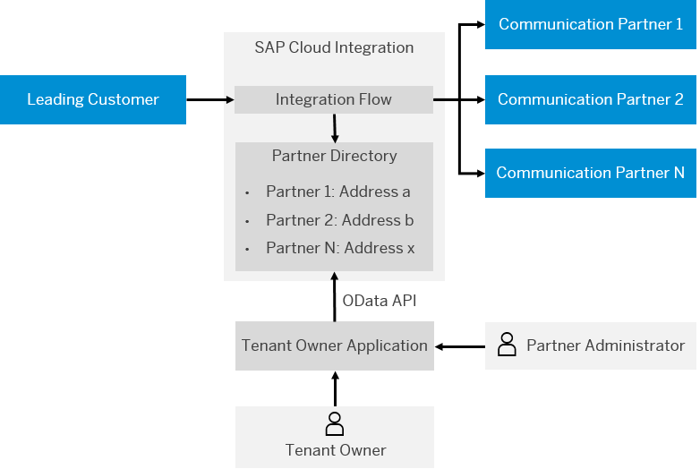

<!-- loioe7fa1e2cd16049b7bfefe938355a574c -->

# Partner Directory

The Partner Directory allows you to store information about communication partners and to parameterize integration flows using this information.

The Partner Directory helps you to set up a communication network between many communication partners efficiently. You use the Partner Directory to store partner-specific information. Those components that are parameterized read this information during runtime from the Partner Directory.

In the context of a business-to-business \(B2B\) scenario involving a partner network, the person or organization that is responsible for the B2B scenario as a whole is also the owner of the SAP Cloud Integration tenant.

Administrators at the side of each business partner use a dedicated application \(referred to as tenant owner application\) to maintain entities in the Partner Directory \(through an OData API\). The tenant owner application is provided to the partners by the tenant owner.

Note that such a tenant owner application is not part of the feature set of SAP Cloud Integration. However, SAP Cloud Integration comes with a set of OData APIs that allow access to the Partner Directory \(and can be used to implement such a tenant owner application\).

As illustrated in the figure, the Partner Directory is embedded in the system landscape in the following way.

<a name="loioe7fa1e2cd16049b7bfefe938355a574c__section_cdn_1pk_pdb"/>

## Partner Directory Entities

The Partner Directory contains the following entities \(which can be accessed using an OData API\):

-   Partner ID \(PID\)

    A partner has an ID \(PID\) that is unique within the Partner Directory. The uniqueness of the PID is ensured by the tenant owner application.

-   Alternative Partner

    A partner can have several alternative identifiers \(Alternative Partner\). The same concepts are applied to the Alternative Partner as to party identifiers in SAP Process Integration: Each Alternative Partner has three string fields: Agency, Scheme, and ID.

    -   Agency

        Name of the organization that defines the identification scheme \(or schema\) and issues names for the objects to be identified.

    -   Scheme

        The reference framework within which objects are uniquely identified by names.

    -   ID

        An ID or name that identifies the object within the given scheme.

    For more information on the alternative partner ID and how it is related to the partner ID, check out the following SAP Community blog: [Cloud Integration – Partner Directory – Partner Dependent XML Structures and IDs](https://blogs.sap.com/2017/08/22/cloud-integration-partner-directory-partner-dependent-xml-structures-and-ids/).

    For more information on the usage of the fields `Agency`, `Scheme`, and `ID`, see the documentation of SAP Process Integration at [http://help.sap.com](http://help.sap.com).

-   Authorized User

    This user authorizes a sending partner system to log in to SAP Cloud Integration \(inbound communication\).

    If the partner uses HTTPS with client certificate authentication to connect to SAP Cloud Integration, certificate-to-user mappings are applied. One or more Authorized Users can be defined for each partner.

-   Partner Directory Parameters for the parameterization of integration flows

The following figure provides an overview of the Partner Directory entities.

The Partner Directory entities related to a partner are maintained by an administrator at the partner organization using the tenant owner application. The Partner Directory entities are accessed using an OData application interface.

The following integration flow components are parameterizable so that partner-specific information \(such as partner endpoint address, specific mapping, client certificates for inbound calls\) can be used at runtime.

-   XSLT: XSLT files are specified by each partner

-   XML Schema Validator: XSD files are specified by each partner

-   HTTP receiver adapter: receiver address \( however, one common user or client certificate is used to call the partner system\)

-   HTTP receiver adapter: user credential

-   HTTP sender adapter: sender partner-specific user or client certificate

-   AS2 receiver adapter: receiver address, partner X509 certificate to encrypt message \(however, one common user or client certificate is used to call the partner system\)

-   AS2 sender adapter: sender partner X.509 certificate to verify partner signature, sender partner-specific user or client certificate

-   SOAP receiver adapter: user credential

-   Script: for accessing partner-specific information and performing partner-specific operations

For Partner Directory parameters of AS2 Sender Adapter, see[Configure the AS2 Sender Adapter](../Development/configure-the-as2-sender-adapter-5d7ee17.md) .

For Partner Directory parameters of AS2 MDN Sender Adapter, see [Configure the AS2 MDN Sender Adapter](../Development/configure-the-as2-mdn-sender-adapter-c54effe.md)

> ### Note:  
> PD parameters are shown in the MPL log as MPL properties.

For a step-by-step example of how to use the Partner Directory, see [https://blogs.sap.com/2017/07/25/cloud-integration-partner-directory-step-by-step-example/](https://blogs.sap.com/2017/07/25/cloud-integration-partner-directory-step-by-step-example/).

> ### Caution:  
> **Limitations**
> 
> Be aware of the following limitations when working with the Partner Directory:
> 
> Size restrictions for the different entity types:
> 
> -   Maximum number of StringParameters overall: 3,000,000 \(corresponds to 10,000 partners each using 300 StringParameters\)
> 
> -   Maximum number of BinaryParameters overall: 400,000 \(corresponds to 10,000 partners each using 40 BinaryParameters\)
> 
> -   Maximum number of AlternativePartners overall: 1,000,000 \(corresponds to 10,000 partners each using 100 AlternativePartners\)
> 
> -   Maximum number of AuthorizedUsers overall: 500,000 \(corresponds to 10,000 partners each using 50 AuthorizedUsers\)
> 
> 
> The maximum size of a keystore is 2 MB \(when using the Neo environment\).
> 
> -   The 2 MB limit corresponds to around 2000 X.509 certificates.
> 
> -   A key pair with a chain of three X.509 certificates consumes about 3 KB, so if the keystore only contains key pairs of this type, then you can store around 600 key pairs in the keystore.
> 
> 
> Limit for certificate-to-user mapping \(when using the Neo environment\): 2 MB \(corresponds to about 2000 X.509 certificates\)

The maximum size of a keystore is 6 MB \(when using the Cloud Foundry environment\).

-   The 6 MB limit corresponds to around 6000 X.509 certificates.

-   A key pair with a chain of three X.509 certificates consumes about 3 KB, so if the keystore only contains key pairs of this type, then you can store around 1800 key pairs in the keystore.

If you upload a whole keystore \(`.jks` file\) to the tenant, the maximum keystore size is limited to 2 MB.

For more informatin on the entities of the Partner Directory and how to work with them, check out the OData API section of this documentation.

For detailed step-by-step descriptions how to use the Partner Directory, see the following blogs:

-   [Cloud Integration – Partner Directory – Step-by-Step Example](https://blogs.sap.com/2017/07/25/cloud-integration-partner-directory-step-by-step-example/)

-   [Cloud Integration – Partner Directory – Partner Dependent XML Structures and IDs](https://blogs.sap.com/2017/08/22/cloud-integration-partner-directory-partner-dependent-xml-structures-and-ids/)

-   [Cloud Integration – Partner Directory – Sender Partner Connecting with Client Certificate Authentication](https://blogs.sap.com/2017/08/24/cloud-integration-partner-directory-sender-partner-connecting-with-client-certificate-authentication/)

-   [Cloud Integration – Partner Directory – Partner Dependent User Credential Selection](https://blogs.sap.com/2017/08/25/cloud-integration-partner-directory-partner-dependent-user-credential-selection/)

-   [Cloud Integration – Partner Directory – Mass Configuration](https://blogs.sap.com/2017/08/25/cloud-integration-partner-directory-mass-configuration/)

**Related Information**  

 <?sap-ot O2O class="- topic/link " href="bbccb60d93474163a1e278bacb64ecb3.xml" text="" desc="" xtrc="link:1" xtrf="file:/home/builder/src/dita-all/cdo1688560638547/loio3268cb35959d4b368fb49de861bfe8a1_en-US/src/content/localization/en-us/e7fa1e2cd16049b7bfefe938355a574c.xml" ?> 

[Partner Authorization \(Inbound\)](../Development/partner-authorization-inbound-c0c9950.md "For inbound calls (when a partner sends a message to the integration platform), a partner authorization check evaluates whether the logged-in user has permission to execute messages with a particular sender partner ID.")

[OData API](../Development/odata-api-a617d6f.md "The Cloud Integration application programming interface (API) allows you to access Cloud Integration resources, for example, monitoring data.")

[Read and Modify Partner Directory Content](../Development/read-and-modify-partner-directory-content-ab10d02.md "You can use the Script step to address Partner Directory content.")

[Dynamically Reading XSLT Mappings from the Partner Directory](../Development/dynamically-reading-xslt-mappings-from-the-partner-directory-66a551a.md "You can configure the XSLT Mapping step in an integration flow to dynamically read XSLT mappings from the Partner Directory. The Mapping step will then point to an XSLT mapping defined in the Partner Directory.")

[Dynamically Reading XSD Files from the Partner Directory](../Development/dynamically-reading-xsd-files-from-the-partner-directory-9331745.md "You can configure the XML Validator step in an integration flow to dynamically read XML schema (XSD) files from the Partner Directory. The XML Validator step will then point to an XSD file in the Partner Directory.")

[Partner Directory Cache](../Development/partner-directory-cache-1577f77.md "To improve performance, Partner Directory is cached.")

