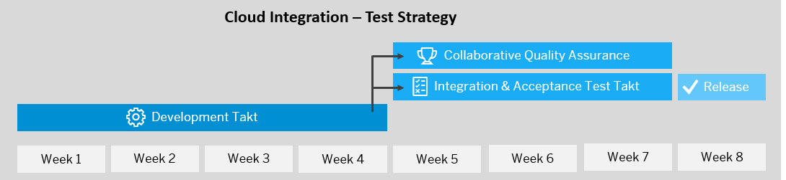
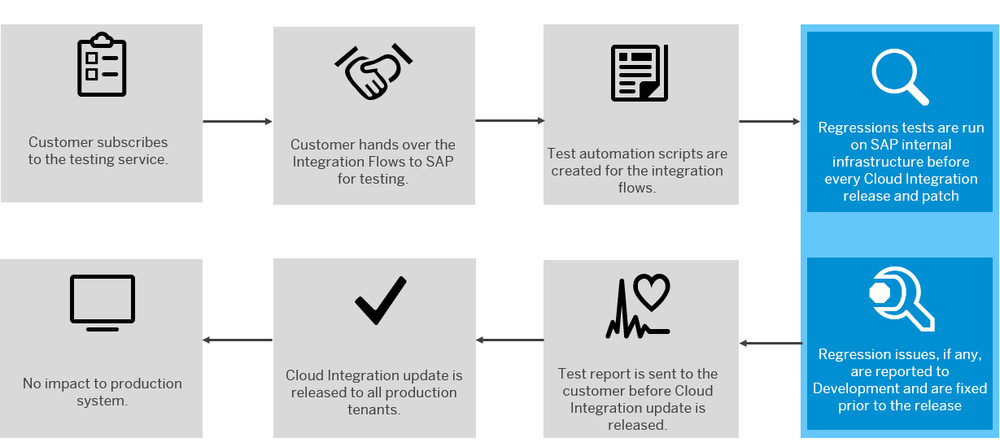

<!-- loio756967bd4de24001b6aae504c7468662 -->

# Quality Assurance

Quality Assurance is central to the SAP Cloud Integration development process. SAP invests significantly into holistic product testing, covering for both functional and non-functional qualities to deliver regression free and flawless new feature increments. The Test Strategy is designed and pivoted on the DevOps principle of Continuous Integration & Continuous Delivery \(CI/CD\) Test pipeline.

SAP Cloud Integration delivers increments after a four-week development cycle and a four week testing cycle. Each of the two cycles is governed by strong assessment and test criteria \(quality KPIs\) which form the basis for acceptance or rejection of the increment.

  
  
**SAP Cloud Integration – Test Strategy**

To deliver quality, a release build version is produced which is assessed by all development teams involved. All of the automated tests from both from Development and Integration and Acceptance test teams are executed daily on a dedicated central landscape and make it into the central CI/CD Test pipeline. The following aspects are part of the test pipeline:

-   SAP BTP environments: Neo, Cloud Foundry

-   Test types: unit, component, system and scenario level

-   Test scope: regression and new features covering for both functional and non-functional aspects \(performance, software installation, updates\).

    Part of the functional tests is also: semantic versioning of adapters and flow-steps \(those new features for integration flows which require configuration are delivered in new versions only; new component versions are used in new integration flow model creations only; existing integration flows remain unchanged and continue to run without interaction; integration flow compatibility, i.e. seamless migration from Neo to Cloud Foundry.\)

> ### Note:  
> See, the release notes for SAP Cloud Integration for functional increments: [SAP Cloud Integration](../WhatsNewInCloudIntegration/sap-cloud-integration-72ef31d.md); see also the patch release notes for SAP Cloud Integration [Patch Releases for Cloud Integration](../WhatsNewInCloudIntegration/patch-releases-for-cloud-integration-023a472.md).

A successful Development Close results in release build version, which is assessed as “ready for productive use” by our first internal customer during the Integration & Acceptance Test takt \(IAT takt\). The scope during the IAT takt is to simulate and validate real-time End-to-End \(E2E\) customer facing scenarios, along with active test engagement with our SAP Application teams and OEM Partners as part of our "Collaborative Quality Assurance".

The acceptance test team challenges the development close assessment by executing the Product Acceptance Tests on a dedicated and well governed test landscape, covering the following quality aspects like:

-   Automated regression tests \(functional and performance\) for integration packs, adapters, manual exploratory tests on new features, software update, cloud qualities and so on, that are executed by Cloud Integration experts from development organization.

-   Manual or automated regression tests \(functional and performance\) of integration packs and adapters as part of "Collaborative Quality Assurance".

-   Automated regression test suites as part of Customer Test Service \(CTS\):

    SAP offers a customer specific regression test service focused specifically on a customer's integration flows. The service helps businesses test non-standard integration content that will ensure business continuity. It includes test automation and regular execution of a customer's scenarios in the context of one acceptance takt, executed by SAP on SAP internal systems. The SAP Cloud Integration development teams add the test success of a customer’s scenarios to the mandatory release criteria \(without extra investment on the test landscape for the customer\) and won’t update any system until the new features have passed the tests. Customers receive a corresponding test report before the system update including resolutions for solving arising issues. During this process, a customer's data is safe and protected.

      
      
    **Customer Test Service**

    

    > ### Note:  
    > If you are interested in more details and/or a commercial offer for this optional and complementary service, contact *sap\_cpi\_test\_automation@exchange.sap.corp*.

**Related Information**  

[https://blogs.sap.com/2018/06/08/sap-cloud-platform-integration-how-we-do-software-updates/](https://blogs.sap.com/2018/06/08/sap-cloud-platform-integration-how-we-do-software-updates/)

